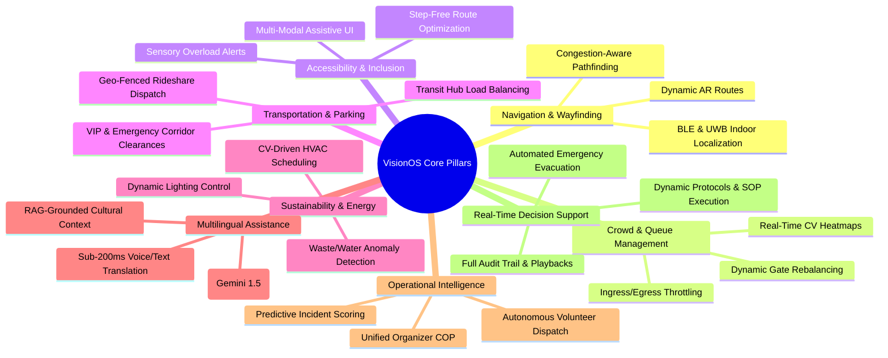
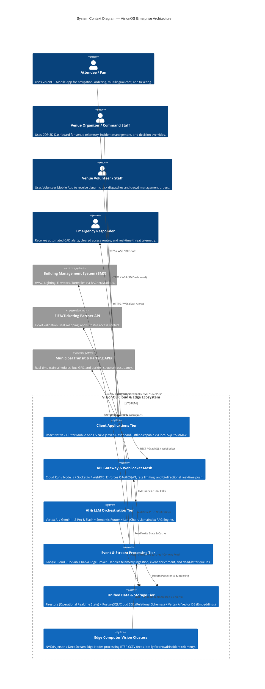

# 00_Project_Vision: VisionOS — AI Operating System for Smart Stadiums

| Attribute | Value |
| :--- | :--- |
| **Title** | VisionOS Project Vision & Strategic Architecture Charter |
| **Version** | 1.0.0 |
| **Status** | APPROVED |
| **Owner** | Lead Product Architect, AI Systems Architect |
| **Purpose** | To define the overarching vision, architectural tenets, target deployment environment, and strategic tradeoffs for VisionOS, serving as the north star for all downstream engineering, UX, AI, and operations documents. |
| **Scope** | Covers the complete ecosystem of smart stadium operations: fan experience, organizer COP (Common Operating Picture), volunteer dispatch, emergency response, and edge-cloud AI/CV infrastructure for a FIFA World Cup–scale venue. |
| **Assumptions** | 1. Venue capacity is up to 85,000 physical attendees with up to 120,000 concurrent connected devices inside the venue boundary. 2. Venue is equipped with private 5G cellular infrastructure, high-density Wi-Fi 6E, and Bluetooth Low Energy (BLE) beacon grids. 3. RTSP camera feeds (4K/1080p at 30 FPS) are available across entry gates, concourses, seating tiers, and perimeter zones. 4. Cloud connectivity to Google Cloud Platform (GCP) / Firebase is active with automated edge-based offline fallback. |
| **Dependencies** | None (This is the root charter document of the VisionOS repository). |
| **References** | • `01_PRD.md` — Product Requirements Document • `02_TRD.md` — Technical Requirements Document • `14_AI_Architecture.md` — AI & LLM Orchestration • `17_Computer_Vision_Pipeline.md` — Camera Pipeline & Edge Inference |

## Revision History

| Version | Date | Author | Description |
| :--- | :--- | :--- | :--- |
| 1.0.0 | 2026-07-13 | Lead Product Architect | Initial production release of VisionOS Strategic Charter. Enforces zero-hallucination, implementation-ready standards across all tiers. |

---

## 1. Executive Summary & Problem Statement

### 1.1 Problem Statement
Modern mega-events, particularly FIFA World Cup–scale tournaments, suffer from fragmented operational systems, static crowd control strategies, delayed emergency escalation, and disjointed fan experiences. When 80,000+ attendees converge on a stadium within a 90-minute ingress window, traditional venue management tools fail due to data silos across ticketing, security, transportation, facilities, and concessions. Fans face confusing navigation, bottlenecked gates, language barriers, and lack of real-time assistance. Organizers and venue staff lack predictive intelligence to preempt safety hazards or dynamically balance infrastructure load.

### 1.2 The VisionOS Solution
**VisionOS** (`AI Operating System for Smart Stadiums`) is an enterprise-grade, event-driven, Generative AI–powered operating platform designed to unify venue operations and revolutionize the attendee journey. By synthesizing real-time edge computer vision, multi-tier LLM reasoning, RAG-grounded operational knowledge, and ultra-low-latency IoT telemetry, VisionOS transforms passive stadium infrastructure into an autonomous, self-optimizing ecosystem.

---

## 2. Core Functional & Operational Pillars

VisionOS is built upon eight interconnected operational capabilities. Every downstream document (`01_PRD.md` through `34_Pitch_Deck_Outline.md`) traces directly to one or more of these pillars:

### 2.1 Navigation & Wayfinding
* **Problem:** Static signage cannot adapt when concourses clog or elevators fail.
* **Solution:** Combines BLE/Ultra-Wideband (UWB) indoor localization with dynamic graph-based routing (`A*` with real-time edge weights derived from CV crowd density). Provides AR camera overlays on fan devices that dynamically reroute users away from congested corridors toward underutilized gates, restrooms, and concessions.

### 2.2 Crowd & Queue Management
* **Problem:** Unanticipated surges at entry gates and concession stands create crush hazards and revenue loss.
* **Solution:** Edge Computer Vision (`17_Computer_Vision_Pipeline.md`) continuously computes queue depth, flow velocity ($V_{flow}$), and density ($D_{crowd}$ in persons/m²). When density crosses critical safety thresholds (>3.5 persons/m²), VisionOS automatically triggers digital signage updates, alerts organizers via the Common Operating Picture (COP), and dispatches volunteer teams to redistribute foot traffic.

### 2.3 Universal Accessibility
* **Problem:** Attendees with mobility, visual, or hearing impairments face friction in high-sensory, high-density environments.
* **Solution:** Dedicated assistive routing ensuring 100% step-free, ADA-compliant paths. Real-time acoustic and visual alerts translated into haptic device prompts. Sensory overload monitoring that flags zones with decibel levels >95 dB or strobe lighting, directing sensitive attendees to designated quiet rooms.

### 2.4 Multi-Modal Transportation & Parking Orchestration
* **Problem:** Post-match egress bottlenecks paralyze surrounding urban transit hubs and parking structures.
* **Solution:** Connects to municipal transit APIs, smart parking gate sensors, and rideshare geofences. Dynamically staggers egress notifications by seating zone based on real-time train platform density and shuttle availability, preventing dangerous crowding at exterior transit nodes.

### 2.5 Sustainability & Energy Optimization
* **Problem:** Empty luxury suites, closed concourse sectors, and underutilized zones consume massive HVAC and electrical power during pre/post-match phases.
* **Solution:** Integrates CV occupancy detection with Building Management Systems (BMS). Automatically throttles HVAC airflow and dims LED illumination in zero-occupancy zones, tracking carbon offset metrics in real time.

### 2.6 Multilingual AI Concierge
* **Problem:** Global international tournaments bring attendees speaking dozens of languages who cannot communicate with local staff.
* **Solution:** Low-latency conversational AI (`14_AI_Architecture.md`) supporting 40+ languages via Vertex AI / Gemini 1.5 Pro & Flash. Provides real-time speech-to-speech translation for medical/security staff and instant text/voice query resolution for fans ("Where is the nearest Halal food vendor with less than a 5-minute wait?").

### 2.7 Operational Intelligence & Command Center (COP)
* **Problem:** Venue directors monitor dozens of disjointed software screens (CCTV, ticketing, medical CAD, access control).
* **Solution:** A unified, glassmorphic 3D digital twin dashboard (`03_UI_UX_Design_System.md`) visualizing real-time alerts, volunteer locations, security incidents, and predictive risk heatmaps on a single canvas.

### 2.8 Real-Time Decision Support & Emergency Response
* **Problem:** In active emergencies (fire, structural compromise, security threat), manual radio coordination introduces lethal delays.
* **Solution:** Automated incident detection workflows (`19_Event_Architecture.md`). Upon verified high-severity triggers, VisionOS immediately generates targeted evacuation routes on digital concourse screens and user mobile devices, overriding standard routing to guide occupants to the safest exterior exits while clearing ingress paths for emergency responders.

---

## 3. Target Deployment Environment (FIFA World Cup–Scale Venue)

To prevent ambiguity, all architectural sizing across this repository is grounded in the following reference environment parameters:

| Parameter | Specification | Engineering Impact |
| :--- | :--- | :--- |
| **Physical Seating Capacity** | 85,000 Seats across 4 Tiers | Requires 4 distinct routing zones and tier-specific egress algorithms. |
| **Concourse & Plaza Area** | 120,000 m² total floor space | Requires 1,500 BLE/UWB beacons spaced at 10m intervals for indoor positioning. |
| **CCTV Camera Infrastructure** | 1,200 IP RTSP Cameras | 800 cameras dedicated to crowd/queue/incident CV processing via Edge clusters (`17_Computer_Vision_Pipeline.md`). |
| **Connected Mobile Devices** | Up to 120,000 peak devices | Requires horizontal scaling for WebSocket gateways (`20_WebSocket_Flow.md`) supporting 100,000 concurrent active socket connections. |
| **Turnstile & Entry Gates** | 64 Perimeter Gates, 128 Turnstiles | Ingress throughput target: 1,200 persons/minute total across venue during peak arrival phase (-60 min to -15 min kickoff). |
| **Staff & Volunteer Force** | 2,500 Active Staff & Volunteers | Requires dedicated, offline-capable mobile client (`Volunteer/Staff UI`) with automated task dispatch (`15_Agent_Specifications.md`). |

---

## 4. System Architecture & Context

---

## 5. Strategic Architectural Tradeoffs & Core Recommendations

To eliminate ambiguity for AI coding agents and implementation engineers, the following foundational architectural decisions are fixed across the entire VisionOS codebase:

### 5.1 Hybrid Edge-Cloud Computer Vision vs. Pure Cloud Video Ingestion
* **Tradeoff Evaluated:** Streaming 800+ 4K CCTV camera feeds (`800 cameras * 15 Mbps = 12 Gbps continuous ingress`) directly to GCP Vertex AI for real-time inference vs. deploying localized NVIDIA Jetson/DeepStream edge clusters inside the stadium server rooms.
* **Recommendation:** **Hybrid Edge-Cloud Inference (`17_Computer_Vision_Pipeline.md`).**
* **Engineering Justification:**
  1. **Latency:** Emergency detection (weapons, fire, crowd crushes) requires sub-100ms inference-to-alert cycles. Cloud round-trips introduce 300–800ms network latency under stadium network contention.
  2. **Bandwidth Cost:** Continuous 12 Gbps cloud ingress incurs catastrophic network egress/ingress charges ($20,000+/day during event peaks).
  3. **Offline Resilience:** If fiber uplinks to GCP sever due to physical accident or cyber attack, edge nodes continue computing crowd density and driving local concourse warning screens autonomously.
  4. **Contract:** Edge nodes output strictly validated JSON event payloads (`CrowdDensityEvent`, `IncidentAlert`) via local Kafka/MQTT over stadium LAN to the Cloud Pub/Sub bridge. Raw video frames never leave the edge unless explicitly requested by the Command Center COP for incident verification.

### 5.2 Multi-Tier AI Router vs. Single Monolithic LLM
* **Tradeoff Evaluated:** Routing every user interaction (including simple FAQ queries like "Where is Gate 4?") to a heavy reasoning model (e.g., Gemini 1.5 Pro or GPT-4o) vs. implementing a deterministic + semantic routing tier (`14_AI_Architecture.md`).
* **Recommendation:** **Three-Tier AI Router (Regex/Vector Cache $\rightarrow$ Gemini 1.5 Flash $\rightarrow$ Gemini 1.5 Pro).**
* **Engineering Justification:**
  1. **Cost Optimization:** 75% of fan queries during an event are spatial or structural FAQs. Servicing these via cached RAG or Gemini 1.5 Flash reduces inference costs by 90%.
  2. **Latency Optimization:** Gemini 1.5 Flash delivers sub-200ms Time-To-First-Token (TTFT), essential for real-time voice translation and live walking navigation.
  3. **High-Reasoning Escalation:** Only complex, multi-variable operational scenarios (e.g., "Gate B turnstiles jammed, 4,000 fans backed up, rain starting in 10 minutes—generate dynamic concourse rerouting plan and dispatch required volunteer teams") escalate to Gemini 1.5 Pro with full tool/function calling access to Firestore and the Event Bus.

### 5.3 Hybrid Relational + Document + Vector Data Store vs. Single Database
* **Tradeoff Evaluated:** Forcing all transactional, real-time spatial, and high-dimensional vector data into a single database (e.g., PostgreSQL only or MongoDB only).
* **Recommendation:** **Polyglot Persistence Layer (`11_Backend_Schema.md` & `12_Firestore_Schema.md`).**
* **Engineering Justification:**
  1. **Google Cloud Firestore:** Chosen specifically for its mobile client `onSnapshot` real-time sync, built-in offline caching (`Offline Persistence`), and document structure tailored for live attendee sessions, mobile alerts, and dynamic task status updates.
  2. **Cloud SQL (PostgreSQL):** Chosen for relational integrity, transactional ACID guarantees (ticketing audit trails, financial transactions, staff RBAC tables), and spatial indexing via `PostGIS` (stadium floor plan geometry, zone polygons, and routing graph topology).
  3. **Vertex AI Vector Search:** Dedicated vector database optimized for exact-nearest-neighbor (ANN) search over millions of chunks (standard operating procedures, past incident resolutions, multilingual embedding representations).

### 5.4 Asynchronous Event-Driven Architecture vs. Synchronous REST Polling
* **Tradeoff Evaluated:** Client devices and internal services polling REST APIs every 5 seconds vs. an event-driven Pub/Sub + WebSocket architecture (`19_Event_Architecture.md` & `20_WebSocket_Flow.md`).
* **Recommendation:** **Event-Driven Pub/Sub + WebSocket Mesh.**
* **Engineering Justification:**
  * Synchronous polling by 120,000 mobile clients creates massive thundering herd problems (`24,000 requests/sec` just for polling), exhausting API Gateway connection pools and draining mobile battery life. WebSockets over a stateless Cloud Run gateway cluster backed by Redis Pub/Sub ensure immediate push of critical updates while maintaining backpressure resistance during match goal celebrations.

---

## 6. Document Traceability & Repository Roadmap

Every engineering artifact generated in this project strictly obeys the exact sequence below. Engineers and AI agents MUST verify references before implementing any component:

| Phase | Document Code | Document Title | Primary Purpose & Traceability Target |
| :--- | :--- | :--- | :--- |
| **00: Strategy** | `00_Project_Vision.md` | Project Vision & Charter | Root strategic anchor. Traced by `01_PRD`, `02_TRD`. |
| **01: Requirements** | `01_PRD.md` | Product Requirements Document | Traces functional requirements (`FR-001` to `FR-080`). |
| **01: Requirements** | `02_TRD.md` | Technical Requirements Document | Traces non-functional, latency, SLA, and hardware limits. |
| **02: Design & UX** | `03_UI_UX_Design_System.md` | UI/UX Design System | Traces visual design, tokens, dark/light mode, accessibility rules. |
| **02: Design & UX** | `04_UX_Research.md` | UX Research & Empirical Findings | Justifies UI patterns based on high-stress stadium field trials. |
| **02: Design & UX** | `05_User_Personas.md` | User Personas & Role Matrix | Defines specific user access tiers, pain points, and device profiles. |
| **02: Design & UX** | `06_Information_Architecture.md` | Information Architecture & Sitemap | Traces structural navigation across Fan, Staff, Organizer, Emergency UIs. |
| **02: Design & UX** | `07_App_Flow.md` | Application State & Screen Flows | Traces exact state transitions (`State Diagrams`) for all interfaces. |
| **02: Design & UX** | `08_User_Journeys.md` | End-to-End User Journeys | Traces multi-step workflows (Ingress, Emergency Evacuation, Ordering). |
| **02: Design & UX** | `09_Wireframes.md` | Structural Wireframes & Layouts | ASCII/Mermaid structural representations of core screens. |
| **02: Design & UX** | `10_Component_Library.md` | UI Component Library Specs | Traces exact prop definitions, states, and accessibility ARIA tags. |
| **03: Backend & Data** | `11_Backend_Schema.md` | Relational & Spatial Database Schema | Complete PostgreSQL/PostGIS DDL schemas, indexes, and validation. |
| **03: Backend & Data** | `12_Firestore_Schema.md` | Firestore NoSQL Production Schema | Collections, documents, subcollections, TTL, Security Rules, Realtime sync. |
| **03: Backend & Data** | `13_API_Specification.md` | REST / GraphQL / WebSocket APIs | Every endpoint defined with exact JSON request/response contracts and error codes. |
| **04: AI & CV** | `14_AI_Architecture.md` | AI System & LLM Orchestration | Traces AI Router, Prompt Router, Tool Calling, and Conversation Memory. |
| **04: AI & CV** | `15_Agent_Specifications.md` | Autonomous Agent Specifications | Defines autonomous background agents (Crowd Agent, Dispatch Agent, RAG Agent). |
| **04: AI & CV** | `16_Prompt_Library.md` | Production Prompt Library | System prompts, few-shot examples, safety guardrails, and fallback strings. |
| **04: AI & CV** | `17_Computer_Vision_Pipeline.md` | Computer Vision & Edge Architecture | Traces RTSP ingestion, crowd bounding boxes, heatmaps, and edge inference DTOs. |
| **04: AI & CV** | `18_RAG_Architecture.md` | Retrieval-Augmented Generation | Chunking strategies, embedding models (`text-embedding-004`), hybrid search. |
| **05: Realtime & State** | `19_Event_Architecture.md` | Pub/Sub & Event Stream Architecture | Event schemas (`Avro/JSON`), topic topologies, and dead-letter queue recovery. |
| **05: Realtime & State** | `20_WebSocket_Flow.md` | WebSocket Protocol & Gateway Flow | Socket lifecycle, room subscriptions (`stadium:zone:12`), heartbeat & reconnects. |
| **05: Realtime & State** | `21_State_Management.md` | Client & Server State Management | Redux/Zustand client state graphs, optimistic updates, and conflict resolution. |
| **06: DevOps & Sec** | `22_Security_Model.md` | Security, RBAC & Threat Architecture | Zero-Trust model, JWT/OAuth2 claims, API Gateway hardening, and Audit logging. |
| **06: DevOps & Sec** | `23_Testing_Strategy.md` | Comprehensive Testing Strategy | Traces unit, integration, contract, E2E, accessibility, chaos, and AI evaluation. |
| **06: DevOps & Sec** | `24_CI_CD.md` | CI/CD Pipelines & Quality Gates | GitHub Actions/Cloud Build definitions, static analysis, and preview environments. |
| **06: DevOps & Sec** | `25_Deployment.md` | Blue-Green & Multi-Region Deployment | Docker configurations, Cloud Run/GKE manifests, Firebase hosting, and rollbacks. |
| **06: DevOps & Sec** | `26_Monitoring.md` | Observability, Logging & Alerting | OpenTelemetry metrics, Prometheus/Grafana dashboards, PagerDuty escalation rules. |
| **07: Governance** | `27_Sprint_Plan.md` | Phased Agile Implementation Roadmap | Detailed sprint breakdown for engineering execution from Zero to Production. |
| **07: Governance** | `28_Task_Breakdown.md` | Granular Task & Ticket Breakdown | Epic/Story/Task hierarchical mapping with estimation points and acceptance criteria. |
| **07: Governance** | `29_Coding_Standards.md` | Enterprise Coding Standards | Traces folder structure, naming conventions, error handling, and Git rules. |
| **07: Governance** | `30_Antigravity_Rules.md` | AI Coding Agent Rules & Mandates | Authoritative constraints for AI coding assistants (`Antigravity`). |
| **07: Governance** | `31_Ponytail_Rules.md` | Architectural Simplicity & Minimal Code | Mandates against over-engineering, dead code, and speculative abstractions. |
| **07: Governance** | `32_Acceptance_Checklists.md` | Production Acceptance Checklists | 7-part checklists (Functional, UX, Perf, Sec, Accessibility, Test, Deploy) per feature. |
| **08: Delivery** | `33_Demo_Guide.md` | Hackathon & Executive Demo Guide | Minute-by-minute demo script, failure recovery, offline fallback, and judge Q&A. |
| **08: Delivery** | `34_Pitch_Deck_Outline.md` | Investor & Strategic Pitch Deck | Comprehensive slide-by-slide narrative for stakeholders and investors. |

---

## 7. Mandatory Engineering Mandates & Quality Constraints

To enforce "Prioritize correctness over speed" across all future AI agent iterations and human code commits, the following overarching constraints are established by this document:

1. **Zero Hallucination Policy:** If any specific vendor API, hardware model, or protocol detail is not yet empirically confirmed or specified by the user, it MUST be marked verbatim as:
   * `ASSUMPTION: <Clear description of the assumed parameter>`
   * `CONFIGURATION REQUIRED: <Exact environment variable or setting name to be configured>`
2. **No Placeholder Text or Mock Data Without Formal Schema:** The terms `lorem ipsum`, `todo`, `fixme`, `xyz`, and fabricated endpoint responses are strictly forbidden. All examples must use realistic, structurally valid JSON/SQL that complies with the documented schemas.
3. **Traceability Guarantee:** Every API endpoint in `13_API_Specification.md` must link to a table in `11_Backend_Schema.md` or `12_Firestore_Schema.md`, and every component in `10_Component_Library.md` must link to a design token in `03_UI_UX_Design_System.md`.
