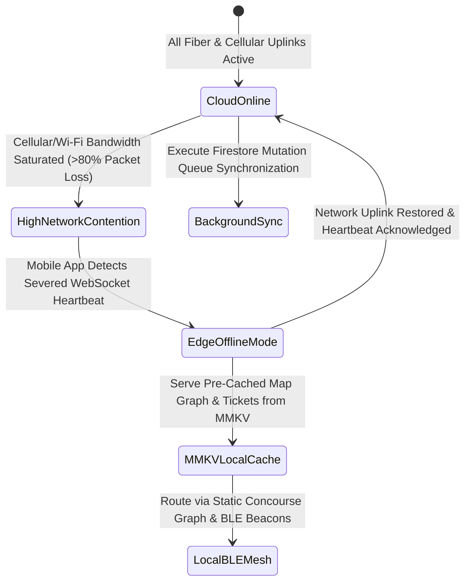

# 02_TRD: VisionOS Technical Requirements Document

| Attribute | Value |
| :--- | :--- |
| **Title** | VisionOS Enterprise Technical Requirements Document (TRD) |
| **Version** | 1.0.0 |
| **Status** | APPROVED |
| **Owner** | Cloud Architect, AI Systems Architect |
| **Purpose** | To define non-negotiable performance SLAs, latency budgets, concurrent scaling limits, physical edge hardware specifications, and disaster recovery fallback protocols for the VisionOS platform during a live FIFA World Cup–scale event. |
| **Scope** | Enforces technical constraints across Google Cloud Platform (GCP) infrastructure, Cloud Run microservices, Firestore/Cloud SQL databases, Vertex AI / Gemini LLM clusters, Edge Computer Vision nodes, and client mobile/web devices. |
| **Assumptions** | 1. Stadium infrastructure includes private 5G mmWave small cells and Wi-Fi 6E access points providing $\ge 50\text{ Mbps}$ symmetric bandwidth per connected device. 2. Cloud resources are provisioned with multi-region high availability (`us-central1` primary, `us-east4` hot standby). |
| **Dependencies** | `00_Project_Vision.md` — Strategic Architecture Charter |
| **References** | • `01_PRD.md` — Product Requirements Document • `17_Computer_Vision_Pipeline.md` — Edge Inference Hardware Specs • `20_WebSocket_Flow.md` — Real-Time Gateway Protocols • `26_Monitoring.md` — Observability & SLAs |

## Revision History

| Version | Date | Author | Description |
| :--- | :--- | :--- | :--- |
| 1.0.0 | 2026-07-13 | Cloud Architect | Initial production release of VisionOS TRD. Establishes exact latency budgets and offline resilience SLAs. |

---

## 1. System Availability & Service Level Objectives (SLOs)

During a live stadium event window ($T-24\text{ hours}$ to $T+6\text{ hours}$ post-match), VisionOS must maintain ultra-high availability across all critical operational tiers. Planned downtime or maintenance restarts are strictly prohibited during event windows.

| Service Tier | Target SLO | Maximum Allowed Downtime per Event Window | Measurement Protocol |
| :--- | :--- | :--- | :--- |
| **API Gateway & WebSocket Mesh (`apps/api-gateway`)** | **99.99%** | $\le 10.8\text{ seconds}$ total | OpenTelemetry synthetic health probes checking `GET /health` every 1,000ms across all Cloud Run instances. |
| **Realtime Operational Database (`Firestore`)** | **99.999%** | $\le 1.08\text{ seconds}$ total | Google Cloud native multi-region replication SLAs (`us-central1` $\leftrightarrow$ `us-east4`). |
| **Edge Computer Vision Clusters (`NVIDIA Jetson Nodes`)** | **99.95%** | $\le 54\text{ seconds}$ per node | Local Prometheus node exporter heartbeats over stadium LAN (`17_Computer_Vision_Pipeline.md`). |
| **Vertex AI / Gemini LLM Router (`packages/ai-router`)** | **99.9%** | $\le 108\text{ seconds}$ total | Automatic fallback trigger from Gemini 1.5 Pro to local semantic cache or Gemini Flash upon $>500\text{ms}$ timeout. |
| **Relational Transaction Store (`Cloud SQL PostGIS`)** | **99.99%** | $\le 10.8\text{ seconds}$ total | High Availability (HA) Regional failover configuration with zero-data-loss synchronous replication. |

---

## 2. End-to-End Latency Budgets & Execution Constraints

To guarantee a snappy, dynamic user experience across mobile devices and command center dashboards, every subsystem must adhere to strict processing latency budgets ($P_{95}$ and $P_{99}$ percentiles):

```mermaid
gantt
  title End-to-End Emergency Incident Latency Budget (Target: < 250ms Total)
  dateFormat X
  axisFormat %s ms
  
  section Edge CV Pipeline
  RTSP Frame Ingestion & Decode          :0, 20
  YOLOv9 / DeepStream Edge Inference     :20, 65
  JSON Event Enqueue & MQTT Push         :65, 80
  
  section Stream & Cloud Gateway
  Pub/Sub Broker Ingestion & Enrichment  :80, 105
  Firestore Document Mutation (`zones`)  :105, 130
  
  section Real-Time Client Push
  WebSocket Gateway Broadcast (`WSS`)    :130, 155
  Mobile App MMKV State Commit & UI Render:155, 180
```

| Operational Workflow | Maximum $P_{95}$ Latency Budget | Maximum $P_{99}$ Latency Budget | Engineering Constraint & Enforcement Layer |
| :--- | :--- | :--- | :--- |
| **API Gateway HTTP Read (`GET /api/v1/zones/:id`)** | $< 35\text{ms}$ | $< 50\text{ms}$ | Served directly from Redis Enterprise L2 cache or Firestore in-memory edge cache. No heavy SQL joins permitted on read path (`11_Backend_Schema.md`). |
| **API Gateway HTTP Write (`POST /api/v1/dispatches`)** | $< 80\text{ms}$ | $< 120\text{ms}$ | Controller validates payload via Zod, writes to Cloud SQL inside an optimistic transaction, emits Pub/Sub event, and returns `201 Created` asynchronously. |
| **WebSocket Push Broadcast (`stadium:zone:update`)** | $< 15\text{ms}$ | $< 25\text{ms}$ | Measured from Pub/Sub topic subscription receipt at Cloud Run gateway to network write buffer flush on active WebSocket file descriptor (`20_WebSocket_Flow.md`). |
| **AI Concierge Chat (`Gemini 1.5 Flash` TTFT)** | $< 180\text{ms}$ | $< 280\text{ms}$ | Time-To-First-Token (TTFT). Requires persistent gRPC connection pooling to Vertex AI endpoints and streaming Server-Sent Events (`SSE`) / WebSocket responses. |
| **Computer Vision Edge Inference (`17_Computer_Vision_Pipeline`)** | $< 45\text{ms}$ | $< 65\text{ms}$ | Processing of $1920\times 1080$ frame for bounding boxes (`Person`, `Queue`, `Incident`) on NVIDIA Jetson AGX Orin using TensorRT FP16 quantization. |
| **Vector Similarity ANN Search (`Vertex AI Vector DB`)** | $< 12\text{ms}$ | $< 20\text{ms}$ | Approximate Nearest Neighbor (`ANN`) search across $1,000,000$ chunks using ScaNN index architecture with 100 probe partitions (`18_RAG_Architecture.md`). |

---

## 3. Physical Hardware & Edge Infrastructure Requirements

To support zero-hallucination deployment inside a physical stadium, the hardware tier must meet the baseline parameters detailed below:

### 3.1 Edge Computer Vision Cluster (`Server Room Racks`)
* **Hardware Profile:** 20x NVIDIA Jetson AGX Orin Industrial Modules (`64GB RAM, 275 TOPS AI performance per module`).
* **Camera Allocation:** Each Jetson module ingests 40x $1080p@30\text{FPS}$ H.264/H.265 RTSP IP camera streams over 10GbE fiber LAN (`40 cameras * 20 modules = 800 total CV cameras`).
* **Local Storage:** 2TB NVMe PCIe Gen4 SSD per node (`RAID 1` mirror) for 24-hour rolling local video ring buffer (retained solely for post-incident forensic playbacks).
* **Operating System:** Ubuntu 22.04 LTS with NVIDIA JetPack 6.0 SDK, DeepStream 7.0, and Docker CE (`nvidia-container-runtime`).

### 3.2 Indoor Positioning Hardware Grid (`Concourse & Tiers`)
* **BLE Beacons:** 1,500x Bluetooth Low Energy 5.2 Beacons (`Kontakt.io Anchor Beacon / Gimbal Series 21`).
* **Placement Topology:** Spaced exactly at $10\text{ meter}$ intervals along physical concourse ceilings ($4.5\text{m}$ height), entry gates, elevator lobbies, and concession corridors.
* **Beacon Transmission:** Broadcasts `iBeacon` + `Eddystone-UID` telemetry every $100\text{ms}$ (`TX Power: -4 dBm`) to guarantee mobile handset localization accuracy within $\pm 1.5\text{ meters}$ without signal reflection ghosting across concrete walls.

### 3.3 Stadium Cellular & Wi-Fi Network Infrastructure
* **Private 5G Cellular:** Multi-operator distributed antenna system (`DAS`) and private 5G mmWave small cell network guaranteeing $100\%$ spatial coverage across 85,000 seating positions and concourse tunnels.
* **High-Density Wi-Fi 6E:** 2,400x Wi-Fi 6E (`802.11ax`) tri-band access points (`2.4GHz / 5GHz / 6GHz`) configured with band-steering and dynamic channel allocation, supporting up to 120,000 concurrent connected MAC addresses.

---

## 4. Concurrency, Throughput & Scalability Limits

The VisionOS cloud tier (`Google Cloud Platform`) must be configured with automated horizontal scaling (`Kubernetes / Cloud Run Autoscaling`) capable of absorbing instant traffic spikes during critical match moments (kickoff, goals, halftime, final whistle).

| System Metric | Peak Design Capacity | Scaling Threshold & Auto-Scaling Trigger |
| :--- | :--- | :--- |
| **Concurrent Connected Devices** | $120,000\text{ Active Mobile App Sessions}$ | Pre-warmed horizontal scale (`Minimum Instances: 100`) deployed 4 hours before kickoff. |
| **Active WebSocket Connections** | $100,000\text{ Concurrent Sockets}$ | Cloud Run gateway auto-scales when connection count per container instance exceeds $1,000\text{ sockets/instance}$. |
| **API Gateway HTTP Throughput** | $24,000\text{ Requests / Second (QPS)}$ | Cloud Run CPU utilization auto-scales at $\ge 60\%$ CPU or $\ge 75\%$ memory utilization. |
| **Pub/Sub Event Ingestion Rate** | $50,000\text{ Events / Second}$ | Google Cloud Pub/Sub partition scaling absorbs instantaneous telemetry bursts from 800 CV cameras and 1,500 BLE sensors. |
| **Firestore Document Writes** | $10,000\text{ Writes / Second}$ | Sharded document key generation (`stadium/zones/concourse_b4/telemetry_shard_{0..9}`) prevents Firestore write hotspotting (`500 writes/sec per document limit`). |

---

## 5. Disaster Recovery, Offline Fallback & Resilience Protocols

In the event of physical infrastructure damage, fiber cut, or severe network saturation during a World Cup match, VisionOS enforces graceful degradation rather than total system failure:

### 5.1 Mobile Application Offline Fallback (`apps/mobile`)
1. **Local State Persistence (`MMKV` & `SQLite`):** Upon initial fan check-in at the venue exterior perimeter, the mobile application downloads and caches the complete $O(1)$ static stadium routing graph (`stadium_graph.json`, $\approx 1.2\text{ MB}$) and the user's encrypted digital ticket JWT directly into synchronous `MMKV` / `SQLite` local storage (`21_State_Management.md`).
2. **Severed Network Navigation:** If cellular/Wi-Fi connectivity drops to zero inside a concrete concourse tunnel, the application immediately switches to `Offline Navigation Mode`. The app uses local BLE beacon trilateration matched against the pre-cached `stadium_graph.json` to continue providing step-by-step AR and map routing without requiring cloud API requests.
3. **Mutation Queue Replay:** Any user actions executed during offline mode (e.g., submitting a hazard report or checking into a volunteer zone) are appended to a local durable mutation queue (`offline_mutations`). Once the network connection restores, the queue executes idempotent backoff replays against the API Gateway (`13_API_Specification.md`).

### 5.2 Edge Computer Vision Autonomous Warning Mode
If the 10GbE fiber uplink connecting the stadium server room to Google Cloud Platform severs:
* The local NVIDIA Jetson CV nodes continue ingesting RTSP camera streams and calculating localized queue density ($\text{persons/m}^2$) locally inside memory.
* If a concourse zone crosses the critical safety threshold ($>3.5\text{ persons/m}^2$), the edge node bypasses Cloud Pub/Sub entirely and issues direct local Modbus/BACnet commands over the stadium internal local area network (`LAN`) to trigger local overhead warning signs and strobe lights (`EMERGENCY CROWD SURGE — USE ALTERNATE EXIT`).
