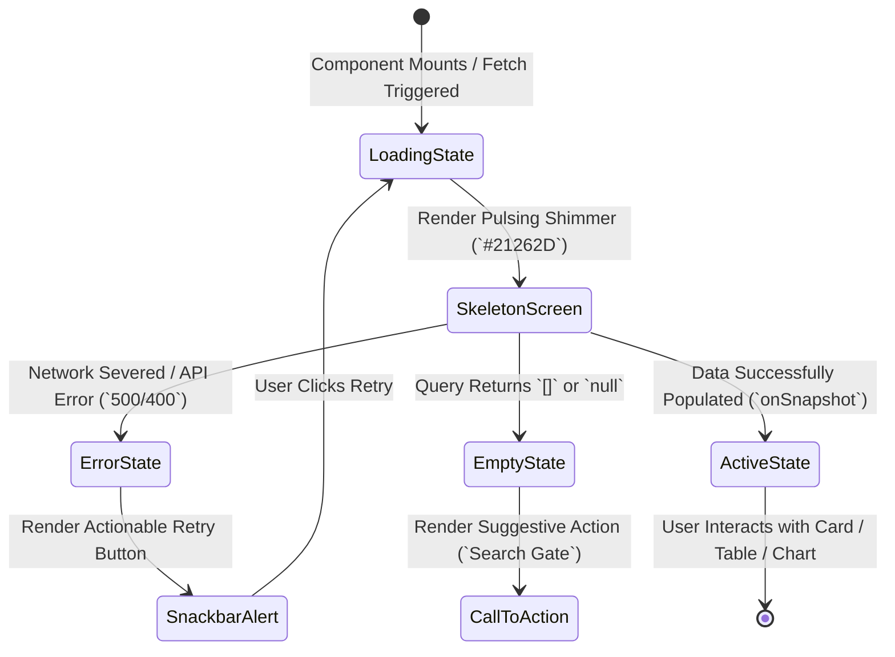

# 03_UI_UX_Design_System: VisionOS Enterprise UI/UX Design System & Token Specification

| Attribute | Value |
| :--- | :--- |
| **Title** | VisionOS Enterprise UI/UX Design System & Token Specification (`Quantum Glass`) |
| **Version** | 1.0.0 |
| **Status** | APPROVED |
| **Owner** | Principal UX Designer, Lead Product Architect |
| **Purpose** | To define the absolute, implementation-ready visual design system, design tokens, responsive grid rules, glassmorphism aesthetics, motion timing curves, accessibility standards, and state patterns across all VisionOS client applications. |
| **Scope** | Enforced across React Native mobile applications (`apps/mobile`), Next.js 15 Command Center (COP) web dashboards (`apps/web`), and shared UI component libraries (`@visionos/shared`). |
| **Assumptions** | 1. Mobile devices operate in extreme outdoor sunlight ($1,000+\text{ nits}$) and high-contrast night stadium illumination, requiring high-contrast dark and light modes.<br>2. Attendees under high emotional or emergency stress experience cognitive tunnel vision, requiring clear hierarchy and instant visual affordances. |
| **Dependencies** | `00_Project_Vision.md` — Strategic Architecture Charter |
| **References** | • `01_PRD.md` — Product Requirements Document<br>• `10_Component_Library.md` — Atomic UI Component Contracts<br>• `29_Coding_Standards.md` — Enterprise Coding Standards |

## Revision History

| Version | Date | Author | Description |
| :--- | :--- | :--- | :--- |
| 1.0.0 | 2026-07-13 | Principal UX Designer | Initial production release of the `Quantum Glass` Design System. Enforces WCAG Level AAA accessibility and exact design token variables. |

---

## 1. Design System Philosophy (`Quantum Glass`)

The **Quantum Glass** design system balances **High-Signal Operational Precision** with **Premium Dynamic Aesthetics**. In a FIFA World Cup–scale stadium, UI is not merely decorative; it is life-safety navigation infrastructure.

```mermaid
graph TD
  subgraph CoreAesthetics [Quantum Glass Foundation]
    Dark[Deep Space Dark Mode `#0D1117`]
    Glass[Glassmorphism Layers `blur(16px)`]
    Motion[Micro-Animation Physics `cubic-bezier(0.16,1,0.3,1)`]
  end

  subgraph FunctionalClarity [High-Signal Contrast & Affordance]
    Contrast[WCAG 2.2 AAA Contrast `7:1 Ratio`]
    Typography[Geometric Sans `Inter` & `Outfit`]
    Tokens[Strict CSS / JSON Design Tokens]
  end

  subgraph TargetInterfaces [Multi-Platform Deployment]
    Mobile[React Native Mobile App (`Fan & Volunteer`)]
    COP[Next.js 3D Command Center (`Organizer COP`)]
    Emergency[High-Contrast Emergency Override Banner]
  end

  CoreAesthetics --> FunctionalClarity
  FunctionalClarity --> TargetInterfaces
```

### 1.1 Core Aesthetic Principles
1. **Zero Clutter, Maximum Affordance:** Every card, button, and telemetry indicator must communicate its active state instantly without requiring hover explanations or complex sub-menus.
2. **Dynamic Depth via Glassmorphism:** Uses layered background blur (`backdrop-filter`) with subtle luminous border highlights (`rgba(255, 255, 255, 0.12)`) to establish visual elevation hierarchy without heavy, opaque drop shadows.
3. **High-Stress Emergency Override:** When `isEmergencyActive == true`, the design system automatically strips away all glassmorphism blurs, decorative gradients, and non-essential cards, locking the screen into a maximum-contrast solid red (`#FF1E1E`) and white evacuation state (`07_App_Flow.md`).

---

## 2. Design Tokens: Color Palette & Modes

All colors MUST be referenced via CSS Custom Properties (`--color-*`) on web (`Next.js`) or imported from the JSON design token dictionary (`@visionos/shared/src/tokens/colors.json`) on mobile (`React Native`). Hardcoded hex strings inside component files are strictly forbidden (`29_Coding_Standards.md`).

### 2.1 Dark Mode Palette (Primary Stadium Default)
Dark mode is the default experience for fan mobile devices during night matches and for the Organizer 3D COP Command Center to reduce eye fatigue across 12-hour shifts.

| Token Name | Hex Value | HSL Value | RGB Value | Purpose & Architectural Usage |
| :--- | :--- | :--- | :--- | :--- |
| `--color-bg-base` | `#0D1117` | `216° 28% 7%` | `rgb(13, 17, 23)` | Root application background for mobile and web surfaces. |
| `--color-bg-surface` | `#161B22` | `215° 21% 11%` | `rgb(22, 27, 34)` | Primary card, modal, and bottom sheet background layer. |
| `--color-bg-elevated` | `#21262D` | `215° 15% 15%` | `rgb(33, 38, 45)` | Secondary card, hover state, and dropdown menu background. |
| `--color-primary` | `#00F0FF` | `184° 100% 50%` | `rgb(0, 240, 255)` | Primary brand accent, AR navigation chevrons, active tab highlights. |
| `--color-primary-glow` | `rgba(0, 240, 255, 0.25)` | `184° 100% 50% / 0.25` | `rgba(0, 240, 255, 0.25)` | Luminous drop shadow for primary interactive buttons and active AR vectors. |
| `--color-secondary` | `#7000FF` | `266° 100% 50%` | `rgb(112, 0, 255)` | AI Concierge (`Gemini`) indicators, prompt chips, and AI reasoning loaders. |
| `--color-vip-gold` | `#D4AF37` | `46° 65% 52%` | `rgb(212, 175, 55)` | VIP suite badges, premium seating zones, and priority clearance corridors. |
| `--color-status-normal` | `#00E676` | `151° 100% 45%` | `rgb(0, 230, 118)` | Normal crowd density ($\le 2.0\text{ p/m}^2$), green turnstile status, system healthy. |
| `--color-status-warning` | `#FFAB00` | `40° 100% 50%` | `rgb(255, 171, 0)` | Concourse congestion ($2.1\text{ to }3.4\text{ p/m}^2$), wait times $>15\text{ min}$. |
| `--color-status-critical` | `#FF1E1E` | `0° 100% 56%` | `rgb(255, 30, 30)` | Severe crowd surge ($\ge 3.5\text{ p/m}^2$), weapon detected, emergency evacuation. |
| `--color-text-main` | `#F0F6FC` | `210° 40% 96%` | `rgb(240, 246, 252)` | High-contrast primary heading and body copy ($13.8:1\text{ contrast ratio}$). |
| `--color-text-muted` | `#8B949E` | `212° 7% 58%` | `rgb(139, 148, 158)` | Secondary descriptions, timestamps, and inactive tab labels. |

### 2.2 Light Mode Palette (Outdoor Daylight / High-Sunlight Adaptation)
When the mobile device ambient light sensor (`ALS`) detects outdoor sunlight ($>8,000\text{ lux}$), or when `Appearance.getColorScheme() === 'light'`, the UI transitions cleanly to the high-contrast light theme:

| Token Name | Hex Value | HSL Value | RGB Value | Purpose & Architectural Usage |
| :--- | :--- | :--- | :--- | :--- |
| `--color-bg-base` | `#F8FAFC` | `210° 40% 98%` | `rgb(248, 250, 252)` | Root application background under direct sunlight. |
| `--color-bg-surface` | `#FFFFFF` | `0° 0% 100%` | `rgb(255, 255, 255)` | Card and bottom sheet background with crisp $1\text{px}$ borders. |
| `--color-primary` | `#0284C7` | `201° 96% 39%` | `rgb(2, 132, 199)` | High-contrast primary blue (`#00F0FF` is too washed out in direct sun). |
| `--color-text-main` | `#0F172A` | `222° 47% 11%` | `rgb(15, 23, 42)` | Deep slate primary text ($16.4:1\text{ contrast ratio}$ against `#FFFFFF`). |
| `--color-text-muted` | `#475569` | `215° 19% 35%` | `rgb(71, 85, 105)` | Readable secondary text in bright environments. |

---

## 3. Typography System (`Inter` & `Outfit`)

The typography hierarchy uses two complementary Google Fonts:
1. **`Outfit` (Geometric Display):** Used exclusively for high-impact numerical statistics (`Queue Time`, `Crowd Density`, `Scoreboard`) and page headers (`<h1>`, `<h2>`).
2. **`Inter` (Functional Sans-Serif):** Used for all concourse instructions, AI chat logs, form inputs, and data tables due to its superior legibility at small sizes and tabular figure support (`font-variant-numeric: tabular-nums`).

| Token Name | Font Family | Font Size | Line Height | Letter Spacing | Font Weight | Usage Example |
| :--- | :--- | :--- | :--- | :--- | :--- | :--- |
| `--font-size-6xl` | `Outfit` | `48px` (`3.0rem`) | `56px` | `-0.03em` | `700 (Bold)` | Big COP Concourse Alert Counter / Emergency Header |
| `--font-size-4xl` | `Outfit` | `36px` (`2.25rem`) | `44px` | `-0.02em` | `600 (SemiBold)` | Screen Title / Gate Number Display |
| `--font-size-2xl` | `Outfit` | `24px` (`1.5rem`) | `32px` | `-0.01em` | `600 (SemiBold)` | Card Heading / Vendor Name |
| `--font-size-lg` | `Inter` | `18px` (`1.125rem`) | `28px` | `0em` | `500 (Medium)` | Primary Navigation Instruction / AI Chat Query |
| `--font-size-base` | `Inter` | `16px` (`1.0rem`) | `24px` | `0em` | `400 (Regular)` | Standard Body Text / Volunteer Task Description |
| `--font-size-sm` | `Inter` | `14px` (`0.875rem`) | `20px` | `0.01em` | `400 (Regular)` | Secondary Metadata / Table Cell Content |
| `--font-size-xs` | `Inter` | `12px` (`0.75rem`) | `16px` | `0.02em` | `600 (SemiBold)` | Status Badge Label (`CRITICAL`, `NORMAL`, `VIP`) |

---

## 4. Spacing, Fluid Layout & Grid Architecture

All layout dimensions follow a **`4px` baseline scaling matrix (`--space-*`)**. Arbitrary margin or padding values (e.g., `13px` or `27px`) are strictly blocked by pre-commit linting (`29_Coding_Standards.md`).

### 4.1 Spacing Token Scale
```css
:root {
  --space-1: 4px;   --space-2: 8px;   --space-3: 12px;  --space-4: 16px;
  --space-5: 20px;  --space-6: 24px;  --space-8: 32px;  --space-10: 40px;
  --space-12: 48px; --space-16: 64px; --space-20: 80px; --space-24: 96px;
}
```

### 4.2 Grid Topology & Breakpoints
* **Mobile Viewport (`React Native` / `< 768px`):** 4-column fluid grid. $16\text{px}$ (`--space-4`) outer horizontal margin, $12\text{px}$ (`--space-3`) inter-column gutter.
* **Tablet / Emergency Wall Viewport (`768px to 1280px`):** 8-column fluid grid. $24\text{px}$ (`--space-6`) outer margin, $16\text{px}$ gutter.
* **Command Center 3D COP (`Next.js` / `> 1280px`):** 12-column rigid/fluid hybrid layout. Left sidebar ($320\text{px}$ fixed), Right telemetry drawer ($400\text{px}$ fixed), Center 3D WebGL canvas (`flex: 1` fluid).

---

## 5. Glassmorphism & Elevation Layering Specification

Glassmorphism in VisionOS must never compromise text legibility. Every glass panel uses a dual-layer structure: a high-blur translucent background combined with an opaque or high-contrast inner border.

### 5.1 CSS Tokens for Web (`Next.js COP`)
```css
.visionos-glass-card {
  background: rgba(22, 27, 34, 0.72);
  backdrop-filter: blur(16px) saturate(180%);
  -webkit-backdrop-filter: blur(16px) saturate(180%);
  border: 1px solid rgba(255, 255, 255, 0.12);
  box-shadow: 0 8px 32px 0 rgba(0, 0, 0, 0.36);
  border-radius: 16px;
}

.visionos-glass-card-critical {
  background: rgba(255, 30, 30, 0.15);
  backdrop-filter: blur(20px) saturate(200%);
  border: 1.5px solid rgba(255, 30, 30, 0.85);
  box-shadow: 0 0 24px rgba(255, 30, 30, 0.45);
}
```

### 5.2 React Native Mobile Equivalents (`@react-native-community/blur` / `Expo BlurView`)
```tsx
import { BlurView } from 'expo-blur';
import { StyleSheet, View } from 'react-native';

export function GlassSurface({ children, style }: { children: React.ReactNode; style?: any }) {
  return (
    <BlurView intensity={65} tint="dark" style={[styles.glassContainer, style]}>
      <View style={styles.borderOverlay}>{children}</View>
    </BlurView>
  );
}

const styles = StyleSheet.create({
  glassContainer: { borderRadius: 16, overflow: 'hidden' },
  borderOverlay: {
    backgroundColor: 'rgba(22, 27, 34, 0.65)',
    borderWidth: 1,
    borderColor: 'rgba(255, 255, 255, 0.12)',
    padding: 16,
  },
});
```

---

## 6. Motion Timing & Micro-Animation Guidelines

Motion communicates structural relationship and state urgency. All transitions use deterministic spring physics or smooth bezier curves.

| Timing Token | Duration | Cubic-Bezier Curve | Target UI Interaction & Purpose |
| :--- | :--- | :--- | :--- |
| `--motion-fast` | `120ms` | `cubic-bezier(0.2, 0.0, 0.0, 1.0)` | Button click ripple, checkbox toggle, tooltip fade-in. |
| `--motion-base` | `240ms` | `cubic-bezier(0.16, 1.0, 0.3, 1.0)` | Bottom sheet slide-up, card expand, dialog modal entrance. |
| `--motion-slow` | `400ms` | `cubic-bezier(0.4, 0.0, 0.2, 1.0)` | Page transition, 3D stadium camera rotation zoom, navigation drawer open. |
| `--motion-alert` | `600ms (Loop)` | `cubic-bezier(0.36, 0, 0.66, -0.56)` | Critical emergency banner pulse ($1\text{ Hz}$ frequency). |

### 6.1 ADA Motion Reduction (`prefers-reduced-motion: reduce`)
When the OS reports `prefers-reduced-motion: true`, all CSS spring transitions and React Native `Reanimated` layout animations must disable scaling, translation (`translateX/Y`), and 3D rotation, instantly defaulting to a simple `90ms opacity crossfade`.

---

## 7. Comprehensive State & Component UI Specifications

Every UI component deployed in VisionOS must account for all seven functional states: **Default, Hover/Focus, Active/Pressed, Disabled, Loading (Skeleton), Error, and Empty**.



### 7.1 Skeleton Screens & Loading States (`SkeletonCard`)
* **Visual Spec:** A solid rectangle (`border-radius: 12px`) with background `--color-bg-elevated` (`#21262D`).
* **Animation:** A linear shimmer gradient (`#21262D` $\rightarrow$ `#30363D` $\rightarrow$ `#21262D`) translating horizontally at `1.5 seconds per loop`. Never use spinners (`CircularProgress`) for full-screen loading; always use structured skeleton blocks matching the target layout.

### 7.2 Error & Empty States
* **Empty State Card:** Rendered when a concourse zone has no active alerts or a volunteer has zero pending dispatches. Must display a clean monochrome vector icon (`24px`), an `Outfit` heading (`No Active Dispatches`), and a secondary `Inter` suggestion (`You are currently assigned to Sector B4. Stand by for automated routing orders.`).
* **Error State Card:** Rendered upon API or Firestore disconnection. Must display a `#FF1E1E` left-accent border (`4px width`), the exact error code (`ERR_FIREBASE_SEVERED`), and a high-contrast `Retry Synchronously` primary button.

### 7.3 Snackbars & Toast Notifications
* **Position & Z-Index:** Rendered anchored to the bottom of the viewport ($24\text{px}$ offset above bottom navigation bar on mobile, top-right $24\text{px}$ offset on web COP). `z-index: 9999`.
* **Duration & Dismissal:** Standard info snackbars auto-dismiss after `4,000ms`. Critical security or emergency snackbars (`status == CRITICAL`) **never auto-dismiss**; they require explicit manual swipe-to-dismiss (`React Native Gesture Handler`) or confirmation click (`[I Understand]`).

### 7.4 Dialogs & Bottom Sheets (`BottomModalSheet`)
* **Mobile Bottom Sheet:** Uses `Gorhom Bottom Sheet` with three snap points: `25%` (quick summary), `60%` (detailed route/AI chat), `95%` (full expanded menu). Includes a `4px x 36px` pill grabber (`#8B949E`) at the top center.
* **Web Dialog (`Next.js Modal`):** Uses HTML5 `<dialog>` primitive centered in the viewport with a `rgba(0,0,0,0.85)` backdrop blur. Pressing `Escape` or clicking outside the modal box triggers clean dismissal unless `isEmergencyLock == true`.

### 7.5 Dashboard Data Grid & Tables (`Next.js COP Table`)
* **Header Row:** Sticky positioning (`position: sticky; top: 0; z-index: 10`). Background `--color-bg-elevated`, text `--color-text-muted`, `12px uppercase tracking-wider`.
* **Row Interactions:** Row height `48px` (`--space-12`). Hover state changes row background to `rgba(0, 240, 255, 0.08)`. Clicking anywhere on a row highlights the corresponding physical concourse zone inside the adjacent 3D WebGL stadium canvas (`FR-COP-001`).

---

## 8. Interface Access Tiers: Dashboard, Maps, AI Chat & Emergency UI

### 8.1 3D Command Center Dashboard (`Organizer COP UI`)
* **Layout Canvas:** The central WebGL stadium view occupies $65\%$ of the screen width. Concourse heatmaps overlay transparent colored polygons (`#00E676` Normal, `#FFAB00` Warning, `#FF1E1E` Critical) directly onto the 3D concrete architectural models (`PDB/GLTF`).
* **HUD Telemetry Widgets:** Floating glass cards (`.visionos-glass-card`) in the upper right display live real-time counters: `Total Stadium Occupancy (81,420 / 85,000)`, `Turnstile Velocity (1,140/min)`, and `Active Security Dispatches (4)`.

### 8.2 AI Chat Concierge (`AIChatSheet`)
* **Input Bar:** Anchored to bottom inside bottom sheet (`snapPoint: 60%`). Contains a glowing cyan microphone button (`#00F0FF`) for instant speech-to-speech input alongside a standard text field (`Placeholder: Ask anything about Gate 4, Halal food, or exits...`).
* **Message Bubbles:**
  * **User Query Bubble:** Aligned right, background `#0284C7` (Light Mode) or `#1F6FEB` (Dark Mode), text `#FFFFFF`.
  * **AI Concierge Bubble:** Aligned left, glassmorphic dark surface (`#161B22`), featuring a small rotating `Gemini Sparkle Icon` (`#7000FF`) while `isStreaming == true`. Includes interactive action chips below the text (e.g., `[Show Route to Gate B]`, `[Order Mobile Concessions]`).

### 8.3 Emergency & Evacuation UI (`EmergencyEvacBanner`)
When an emergency is triggered, normal navigation and ordering tabs immediately disable (`opacity: 0.2, pointer-events: none`).
* **Visual Lock:** The entire header transforms into a pulsing `#FF1E1E` solid bar.
* **Instruction Display:** Renders a $72\text{px}$ high-contrast white directional arrow pointing left or right, accompanied by text: `EVACUATE NOW — PROCEED TO GATE E4 (STEP-FREE ROUTE CLEAR)`.
* **Audio/Haptic Synchronization:** Mobile device emits a continuous double-pulse haptic vibration pattern synchronized with the visual `1 Hz` CSS alert pulse.
