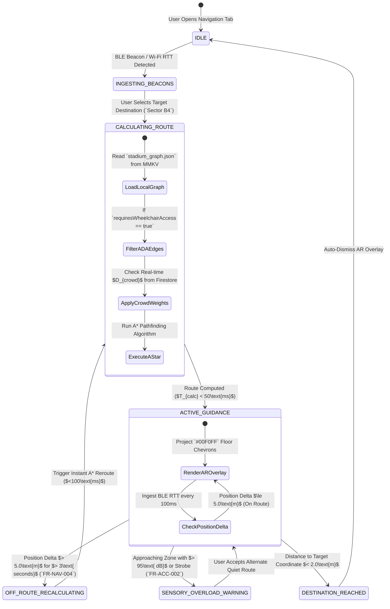
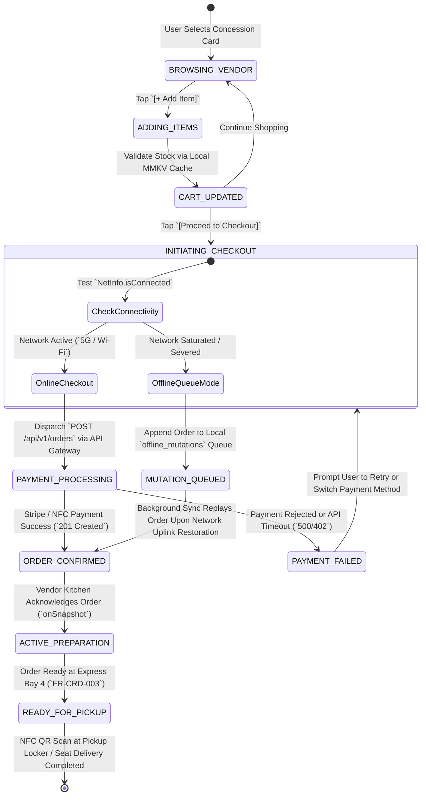
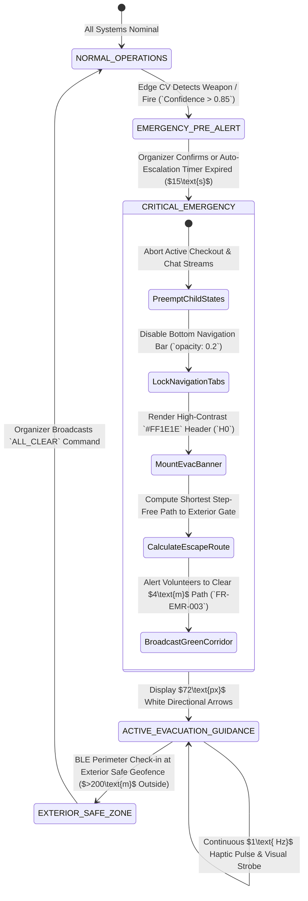

# 07_App_Flow: VisionOS Application State Machine & Flow Specifications

| Attribute | Value |
| :--- | :--- |
| **Title** | VisionOS Application State Machine & Flow Specifications (`StateDiagram-v2`) |
| **Version** | 1.0.0 |
| **Status** | APPROVED |
| **Owner** | Lead Systems Architect, Principal UX Designer |
| **Purpose** | To establish definitive, deterministic finite state machine (`FSM`) models and transition rules governing indoor wayfinding (`NavigationState`), mobile concessions (`OrderingState`), and high-priority critical overrides (`EmergencyState`). |
| **Scope** | Enforces UI state transitions across `apps/mobile` (`Fan & Volunteer App`) and `apps/web` (`Organizer COP Dashboard`), integrated with local `Zustand` (`21_State_Management.md`) and real-time WebSocket events (`20_WebSocket_Flow.md`). |
| **Assumptions** | 1. Network uplinks inside stadium tunnels are volatile; state machines must transition deterministically using local MMKV cache without blocking on cloud confirmation. 2. Emergency state overrides ($P_0$) must immediately preempt and cancel any active background transactions (concessions checkout, chat generation). |
| **Dependencies** | `00_Project_Vision.md` — Strategic Architecture Charter |
| **References** | • `01_PRD.md` — Product Requirements Document • `06_Information_Architecture.md` — Structural Sitemap • `21_State_Management.md` — Zustand & MMKV Stores |

## Revision History

| Version | Date | Author | Description |
| :--- | :--- | :--- | :--- |
| 1.0.0 | 2026-07-13 | Lead Systems Architect | Initial release of VisionOS deterministic state machines (`NavigationState`, `OrderingState`, `EmergencyState`). |

---

## 1. Wayfinding State Machine (`NavigationState` FSM)

The wayfinding state machine handles indoor positioning (`FR-NAV-001`), dynamic graph pathfinding (`FR-NAV-002`), off-route recalculation (`FR-NAV-004`), and ADA step-free constraints (`FR-ACC-001`).

### 1.1 `NavigationState` Transition Guard Matrix
| Current State | Event Trigger | Guard Condition / Validation | Next State | Side Effects & State Store Mutations (`useNavigationStore`) |
| :--- | :--- | :--- | :--- | :--- |
| `IDLE` | `SELECT_DESTINATION` | `beaconCount >= 3` && `targetId != null` | `CALCULATING_ROUTE` | Set `activeRoute = null`, `isCalculating = true`. |
| `ACTIVE_GUIDANCE` | `TELEMETRY_UPDATE` | `distanceFromRouteEdge(currentPos) > 5.0m` | `OFF_ROUTE_RECALCULATING` | Emit haptic double-tap (`80ms`). Set `isOffRoute = true`. |
| `ACTIVE_GUIDANCE` | `SENSORY_ALERT` | `zone.decibels > 95.0` || `user.prefersQuiet == true` | `SENSORY_OVERLOAD_WARNING` | Mount `SensoryAlertSnackbar` (`z-index: 9999`). Pause AR vector arrows. |
| `OFF_ROUTE_RECALCULATING` | `RECALC_SUCCESS` | `newRoute.edges.length > 0` | `ACTIVE_GUIDANCE` | Replace `activeRoute` in MMKV. Set `isOffRoute = false`. |

---

## 2. Mobile Concessions State Machine (`OrderingState` FSM)

To prevent double-charging or abandoned carts during sudden stadium cellular dropouts (`04_UX_Research.md`), the concessions ordering flow utilizes an optimistic offline-to-online transaction state machine (`FR-CRD-003`).

### 2.1 `OrderingState` Transition Guard Matrix
| Current State | Event Trigger | Guard Condition / Validation | Next State | Side Effects & State Store Mutations (`useOrderStore`) |
| :--- | :--- | :--- | :--- | :--- |
| `CART_UPDATED` | `CHECKOUT_CLICK` | `cart.items.length > 0` && `user.ticketId != null` | `INITIATING_CHECKOUT` | Freeze cart edits (`isLocked = true`). Calculate estimated wait time ($T_{wait}$). |
| `INITIATING_CHECKOUT` | `NETWORK_SEVERED` | `NetInfo.isConnected == false` | `MUTATION_QUEUED` | Store payload in SQLite (`sqlite_orders`). Display offline confirmation badge. |
| `PAYMENT_PROCESSING` | `WEBHOOK_SUCCESS` | `response.status == 201` && `order.id != null` | `ORDER_CONFIRMED` | Clear local cart. Subscribe to `/orders/{id}` Firestore document listener. |
| `READY_FOR_PICKUP` | `PICKUP_QR_SCANNED` | `scannedQr == order.pickupCode` | `[*] (COMPLETED)` | Emit high-priority local push notification (`Order Collected`). Archive order. |

---

## 3. Critical Emergency Evacuation State Machine (`EmergencyState` FSM)

When an emergency (`FR-EMR-001`, `FR-EMR-002`) is confirmed via edge CV detection (`17_Computer_Vision_Pipeline.md`) or Organizer override (`ROLE_ORGANIZER`), the `EmergencyState` finite state machine instantly overrides all other active application states (`NavigationState`, `OrderingState`, `AIChatSheet`).

### 3.1 `EmergencyState` Transition Guard & Preemption Rules
1. **Absolute Preemption:** When `stadium.cv.incident` or `stadium.cop.evacuate` (`19_Event_Architecture.md`) is ingested over WebSockets or background push (`FCM/APNs`), the client FSM executes `PreemptChildStates` synchronously within $<16\text{ms}$ (1 frame at 60 FPS).
2. **State Lockout:** While `EmergencyState == CRITICAL_EMERGENCY`, all touch event handlers inside `app/(tabs)/_layout.tsx` return `false`, blocking users from switching back to ordering food or viewing tickets (`FR-EMR-002`).
3. **Safe-Zone Check-in:** The emergency state only disengages when the user's mobile device crosses the exterior geofence perimeter ($>200\text{m}$ from stadium walls) **OR** when Commander Vance (`ROLE_ORGANIZER`) explicitly executes the `POST /api/v1/cop/emergency/clear` API endpoint (`13_API_Specification.md`).
