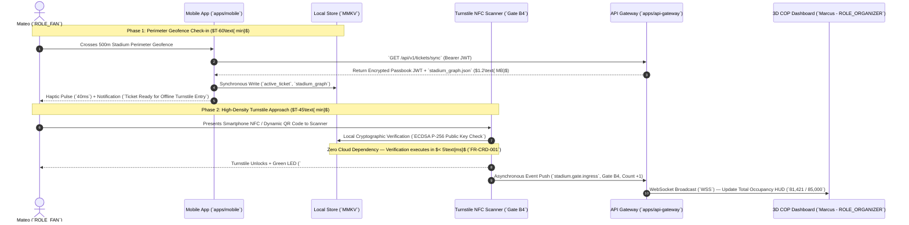
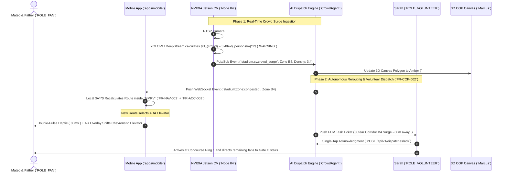
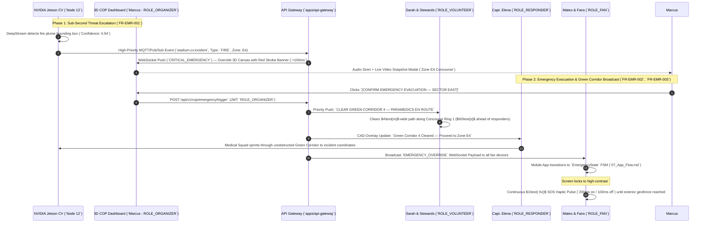

# 08_User_Journeys: VisionOS End-to-End Operational Workflows

| Attribute | Value |
| :--- | :--- |
| **Title** | VisionOS End-to-End Operational User Journeys & Sequence Workflows |
| **Version** | 1.0.0 |
| **Status** | APPROVED |
| **Owner** | Lead UX Architect, Lead Systems Architect |
| **Purpose** | To map step-by-step, cross-functional operational workflows across the fan mobile app, volunteer staff interface, AI router, edge computer vision pipeline, and 3D Command Operating Picture (COP) during real-world stadium events. |
| **Scope** | Covers multi-actor interactions across three critical workflows: Pre-Match Turnstile Ingress, Dynamic Concourse Rerouting (`ADA Wayfinding`), and Critical Emergency Evacuation / Green Corridor Synchronization. |
| **Assumptions** | 1. User journeys must remain fully functional during localized cellular network dropouts via MMKV local state synchronization (`07_App_Flow.md`). 2. Multi-actor dispatch orders require deterministic acknowledgment timeouts ($\le 15\text{ seconds}$) before automated re-dispatch occurs (`15_Agent_Specifications.md`). |
| **Dependencies** | `00_Project_Vision.md` — Strategic Architecture Charter |
| **References** | • `01_PRD.md` — Product Requirements Document • `05_User_Personas.md` — User Role Profiles (`Mateo`, `Sarah`, `Marcus`, `Elena`) • `20_WebSocket_Flow.md` — Real-Time Push Mesh |

## Revision History

| Version | Date | Author | Description |
| :--- | :--- | :--- | :--- |
| 1.0.0 | 2026-07-13 | Lead UX Architect | Initial production release detailing 3 primary cross-functional user journeys (`Ingress`, `ADA Reroute`, `Emergency Evacuation`). |

---

## 1. Journey 1: Pre-Match Perimeter Ingress & Turnstile Check-in (`ROLE_FAN` $\rightarrow$ `API Gateway` $\rightarrow$ `Turnstile`)

This journey traces Mateo Silva (`ROLE_FAN`) approaching Gate B4 45 minutes prior to kickoff during peak ingress velocity (`FR-CRD-001`).

### 1.1 Journey 1 Execution Step Table
| Step # | Actor / Component | Action Taken & Trigger | Expected System Response & Latency Budget | Traceability Requirement |
| :--- | :--- | :--- | :--- | :--- |
| **1.1** | `Mateo` (`ROLE_FAN`) | Crosses exterior geofence boundary ($500\text{m}$ outside venue). | `apps/mobile` wakes up via background geolocation trigger and requests latest ticket payload from API Gateway. | `FR-NAV-001` (`Indoor/Outdoor Localization`) |
| **1.2** | `apps/mobile` | Downloads `stadium_graph.json` and ticket claims. | Writes directly to local `MMKV` synchronous storage. App is now $100\%$ resilient to interior cellular dropouts. | `02_TRD.md` (`Offline Autonomy SLA`) |
| **1.3** | `Turnstile Gate` | Scans Mateo's dynamic QR code at Gate B4 turnstile. | Local gate controller validates ECDSA cryptographic signature in $<5\text{ms}$. Turnstile barrier rotates open. | `FR-CRD-001` (`Edge Queue Ingestion`) |
| **1.4** | `API Gateway` | Ingests asynchronous `stadium.gate.ingress` Pub/Sub event from gate controller. | Increments Firestore document `stadium/metrics/occupancy`. Emits WebSocket update (`WSS`) to Commander Vance's 3D COP canvas within $<25\text{ms}$. | `20_WebSocket_Flow.md` (`Real-Time Push`) |

---

## 2. Journey 2: High-Density Concourse Rerouting & ADA Wayfinding (`ROLE_FAN` $\leftrightarrow$ `Edge CV` $\leftrightarrow$ `DispatchAgent`)

While navigating to Sector 112 with his wheelchair-bound father (`FR-ACC-001`), Mateo encounters a severe bottleneck (`Crowd Density > 3.2 persons/m²`) inside Concourse Ring Level 1.

### 2.1 Journey 2 Execution Step Table
| Step # | Actor / Component | Action Taken & Trigger | Expected System Response & Latency Budget | Traceability Requirement |
| :--- | :--- | :--- | :--- | :--- |
| **2.1** | `NVIDIA Jetson` (`Node 04`) | Analyzes RTSP IP camera feed covering Concourse Ring Level 1 (`17_Computer_Vision_Pipeline.md`). | Computes bounding box density ($D_{crowd} = 3.4\text{ persons/m}^2$). Emits `CrowdAlertPayload` over Pub/Sub within $<65\text{ms}$. | `FR-CRD-001` (`Edge Queue Ingestion`) |
| **2.2** | `CrowdAgent` (`packages/ai-router`) | Ingests `CrowdAlertPayload` and identifies target concourse graph edges crossing warning thresholds. | Doubles edge traversal weights ($W_{edge} \times 2$) inside Firestore routing graph. Emits WebSocket broadcast to all active mobile clients inside Zone B4. | `FR-NAV-002` (`Dynamic Pathfinding`) |
| **2.3** | `apps/mobile` (`Mateo`) | Receives WebSocket congestion alert while `NavigationState == ACTIVE_GUIDANCE`. | Recalculates $A^*$ route locally against `stadium_graph.json`, strictly filtering out stairs (`requiresWheelchairAccess == true`). | `FR-ACC-001` (`Step-Free Route Guarantee`) |
| **2.4** | `apps/mobile` (`Sarah`) | Receives automated task dispatch alert (`[Clear Corridor B4 Surge - 80m away]`) on staff tab. | Sarah taps `[Acknowledge]`. App renders AR guidance guiding her directly to the bottleneck center to assist pedestrian flow. | `FR-COP-002` (`Volunteer Dispatch Engine`) |

---

## 3. Journey 3: Critical Emergency Evacuation & Green Corridor Synchronization (`Edge CV` $\rightarrow$ `Marcus` $\rightarrow$ `Elena`)

During the second half ($T+65\text{ minutes}$), an edge CV camera inside Concourse Zone E4 detects an active structural fire / heavy smoke plume (`Confidence: 0.94`).

### 3.1 Journey 3 Execution Step Table
| Step # | Actor / Component | Action Taken & Trigger | Expected System Response & Latency Budget | Traceability Requirement |
| :--- | :--- | :--- | :--- | :--- |
| **3.1** | `NVIDIA Jetson` (`Node 12`) | DeepStream vision model detects fire/smoke inside Zone E4 (`Confidence > 0.85`). | Instantly pushes `stadium.cv.incident` payload over dedicated fiber uplink. Total inference-to-push latency $<80\text{ms}$. | `FR-EMR-001` (`Incident Detection`) |
| **3.2** | `3D COP Canvas` (`Marcus`) | Ingests `CRITICAL_EMERGENCY` WebSocket event. | 3D WebGL camera auto-zooms to Zone E4 (`FR-COP-001`). Displays flashing red perimeter border (`#FF1E1E`) and live RTSP video snapshot verification modal. | `03_UI_UX_Design_System.md` (`Emergency UI`) |
| **3.3** | `Commander Marcus` | Clicks `[CONFIRM EMERGENCY EVACUATION]` inside COP dashboard. | API Gateway executes global state override across all microservices and Firestore listeners. | `22_Security_Model.md` (`Admin Overrides`) |
| **3.4** | `Capt. Elena` (`ROLE_RESPONDER`) | CAD tactical overlay receives `Green Corridor 4 Active` routing instruction. | Elena's medical squad enters Gate E4 exterior entrance and traverses the pre-cleared $4\text{m}$ corridor directly to the target casualty zone without crowd friction. | `FR-EMR-003` (`Green Corridor Sync`) |
| **3.5** | `apps/mobile` (`Mateo`) | Client FSM transitions synchronously from `ACTIVE_GUIDANCE` to `CRITICAL_EMERGENCY` state. | Strips navigation tabs (`opacity: 0.2`). Renders $72\text{px}$ white evacuation arrow pointing away from Zone E4 toward exterior Gate W2 (guaranteed step-free). | `FR-EMR-002` (`Dynamic Evac Rerouting`) |
