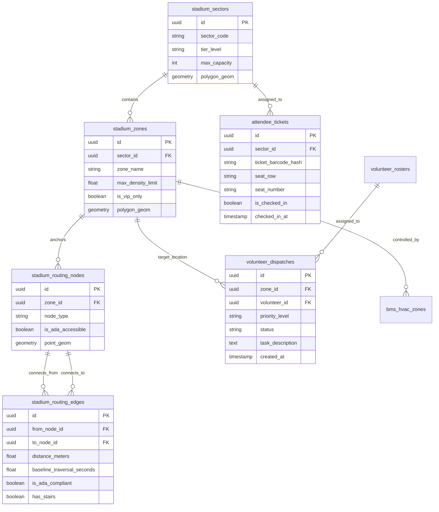

# 11_Backend_Schema: VisionOS Relational PostgreSQL & Cloud SQL PostGIS Schema

| Attribute | Value |
| :--- | :--- |
| **Title** | VisionOS Relational Database Schema & PostGIS Spatial Topologies (`PostgreSQL 16`) |
| **Version** | 1.0.0 |
| **Status** | APPROVED |
| **Owner** | Lead Database Architect, Cloud Systems Architect |
| **Purpose** | To define the exhaustive, implementation-ready relational schema, spatial PostGIS geometries, graph traversal edges, ticket check-in ledgers, and immutable audit logs deployed on Google Cloud SQL (`db-custom-16-65536`). |
| **Scope** | Enforced across `apps/api-gateway` (`Prisma / Drizzle ORM`), spatial routing microservices, and Commander Marcus Vance's historical playback engine (`apps/web`). |
| **Assumptions** | 1. The relational database handles structural geometry, ticketing integrity (`ACID`), and audit logs; volatile high-frequency real-time telemetry ($\ge 1\text{ Hz}$) is stored in Firestore (`12_Firestore_Schema.md`).<br>2. PostGIS 3.4 extension is enabled for $O(1)$ bounding box spatial queries. |
| **Dependencies** | `00_Project_Vision.md` — Strategic Architecture Charter |
| **References** | • `01_PRD.md` — Product Requirements Document<br>• `12_Firestore_Schema.md` — NoSQL Real-Time Telemetry Store<br>• `22_Security_Model.md` — Row-Level Security (RLS) Policies |

## Revision History

| Version | Date | Author | Description |
| :--- | :--- | :--- | :--- |
| 1.0.0 | 2026-07-13 | Lead Database Architect | Initial production release of VisionOS DDL schemas, spatial PostGIS indexes, and audit triggers. |

---

## 1. Schema Topology & Entity Relationship Diagram (`ERD`)



---

## 2. PostgreSQL / PostGIS DDL Implementation Specification

All tables enforce `UUIDv4` primary keys (`uuid-ossp` extension), explicit `TIMESTAMPTZ` audit timestamps, and PostGIS `GEOMETRY(..., 4326)` (`WGS 84`) coordinates.

```sql
-- Enable Extensions
CREATE EXTENSION IF NOT EXISTS "uuid-ossp";
CREATE EXTENSION IF NOT EXISTS "postgis";
CREATE EXTENSION IF NOT EXISTS "btree_gist";

-- Automatically update updated_at timestamp trigger
CREATE OR REPLACE FUNCTION update_modified_column()
RETURNS TRIGGER AS $$
BEGIN
    NEW.updated_at = NOW();
    RETURN NEW;
END;
$$ LANGUAGE plpgsql;

-- ============================================================================
-- TABLE 1: STADIUM SECTORS (Physical Architectural Divisions)
-- ============================================================================
CREATE TABLE IF NOT EXISTS stadium_sectors (
    id UUID PRIMARY KEY DEFAULT uuid_generate_v4(),
    sector_code VARCHAR(16) NOT NULL UNIQUE,       -- e.g., 'SECTOR_112', 'VIP_SUITE_A'
    tier_level VARCHAR(32) NOT NULL,               -- e.g., 'CONCOURSE_LEVEL_1', 'UPPER_TIER'
    max_capacity INTEGER NOT NULL CHECK (max_capacity > 0),
    polygon_geom GEOMETRY(POLYGON, 4326) NOT NULL,
    created_at TIMESTAMPTZ NOT NULL DEFAULT NOW(),
    updated_at TIMESTAMPTZ NOT NULL DEFAULT NOW()
);

CREATE INDEX idx_stadium_sectors_geom ON stadium_sectors USING GIST (polygon_geom);
CREATE TRIGGER trg_stadium_sectors_mod BEFORE UPDATE ON stadium_sectors FOR EACH ROW EXECUTE FUNCTION update_modified_column();

-- ============================================================================
-- TABLE 2: STADIUM ZONES (Localized Concourse & Concession Areas)
-- ============================================================================
CREATE TABLE IF NOT EXISTS stadium_zones (
    id UUID PRIMARY KEY DEFAULT uuid_generate_v4(),
    sector_id UUID NOT NULL REFERENCES stadium_sectors(id) ON DELETE CASCADE,
    zone_code VARCHAR(32) NOT NULL UNIQUE,         -- e.g., 'CONCOURSE_B4_EAST'
    zone_name VARCHAR(128) NOT NULL,
    max_density_limit FLOAT NOT NULL DEFAULT 3.0,  -- Safety limit: persons/m^2
    is_vip_only BOOLEAN NOT NULL DEFAULT FALSE,
    polygon_geom GEOMETRY(POLYGON, 4326) NOT NULL,
    created_at TIMESTAMPTZ NOT NULL DEFAULT NOW(),
    updated_at TIMESTAMPTZ NOT NULL DEFAULT NOW()
);

CREATE INDEX idx_stadium_zones_geom ON stadium_zones USING GIST (polygon_geom);
CREATE INDEX idx_stadium_zones_sector ON stadium_zones(sector_id);
CREATE TRIGGER trg_stadium_zones_mod BEFORE UPDATE ON stadium_zones FOR EACH ROW EXECUTE FUNCTION update_modified_column();

-- ============================================================================
-- TABLE 3: STADIUM ROUTING NODES (Wayfinding Graph Vertices)
-- ============================================================================
CREATE TABLE IF NOT EXISTS stadium_routing_nodes (
    id UUID PRIMARY KEY DEFAULT uuid_generate_v4(),
    zone_id UUID REFERENCES stadium_zones(id) ON DELETE SET NULL,
    node_code VARCHAR(64) NOT NULL UNIQUE,         -- e.g., 'NODE_GATE_B4_ENTRY', 'NODE_ELEVATOR_3_L1'
    node_type VARCHAR(32) NOT NULL CHECK (node_type IN ('GATE', 'ELEVATOR', 'RAMP', 'STAIRS', 'RESTROOM', 'CONCESSION', 'SEAT_PORTAL', 'INTERSECTION')),
    is_ada_accessible BOOLEAN NOT NULL DEFAULT TRUE,
    point_geom GEOMETRY(POINT, 4326) NOT NULL,
    created_at TIMESTAMPTZ NOT NULL DEFAULT NOW()
);

CREATE INDEX idx_routing_nodes_geom ON stadium_routing_nodes USING GIST (point_geom);
CREATE INDEX idx_routing_nodes_type ON stadium_routing_nodes(node_type) WHERE is_ada_accessible = TRUE;

-- ============================================================================
-- TABLE 4: STADIUM ROUTING EDGES (Wayfinding Graph Traversal Paths)
-- ============================================================================
CREATE TABLE IF NOT EXISTS stadium_routing_edges (
    id UUID PRIMARY KEY DEFAULT uuid_generate_v4(),
    from_node_id UUID NOT NULL REFERENCES stadium_routing_nodes(id) ON DELETE CASCADE,
    to_node_id UUID NOT NULL REFERENCES stadium_routing_nodes(id) ON DELETE CASCADE,
    distance_meters FLOAT NOT NULL CHECK (distance_meters > 0),
    baseline_traversal_seconds FLOAT NOT NULL CHECK (baseline_traversal_seconds > 0),
    is_ada_compliant BOOLEAN NOT NULL DEFAULT TRUE,
    has_stairs BOOLEAN NOT NULL DEFAULT FALSE,
    max_incline_ratio FLOAT DEFAULT 0.0,           -- e.g., 0.083 (1:12 ADA max ramp slope)
    line_geom GEOMETRY(LINESTRING, 4326) NOT NULL,
    created_at TIMESTAMPTZ NOT NULL DEFAULT NOW(),
    CONSTRAINT chk_no_self_loop CHECK (from_node_id <> to_node_id)
);

CREATE INDEX idx_routing_edges_nodes ON stadium_routing_edges(from_node_id, to_node_id);
CREATE INDEX idx_routing_edges_ada ON stadium_routing_edges(is_ada_compliant) WHERE is_ada_compliant = TRUE;
CREATE INDEX idx_routing_edges_geom ON stadium_routing_edges USING GIST (line_geom);

-- ============================================================================
-- TABLE 5: ATTENDEE TICKETS (ECDSA Verified Check-in Ledger)
-- ============================================================================
CREATE TABLE IF NOT EXISTS attendee_tickets (
    id UUID PRIMARY KEY DEFAULT uuid_generate_v4(),
    sector_id UUID NOT NULL REFERENCES stadium_sectors(id) ON DELETE RESTRICT,
    ticket_barcode_hash VARCHAR(128) NOT NULL UNIQUE, -- SHA-256 hash of signed passbook JWT
    seat_row VARCHAR(16) NOT NULL,
    seat_number VARCHAR(16) NOT NULL,
    is_vip_tier BOOLEAN NOT NULL DEFAULT FALSE,
    requires_ada_wheelchair BOOLEAN NOT NULL DEFAULT FALSE,
    is_checked_in BOOLEAN NOT NULL DEFAULT FALSE,
    checked_in_at TIMESTAMPTZ,
    entry_gate_code VARCHAR(32),
    created_at TIMESTAMPTZ NOT NULL DEFAULT NOW(),
    updated_at TIMESTAMPTZ NOT NULL DEFAULT NOW()
);

CREATE INDEX idx_attendee_tickets_hash ON attendee_tickets(ticket_barcode_hash);
CREATE INDEX idx_attendee_tickets_checkin ON attendee_tickets(is_checked_in, sector_id);
CREATE TRIGGER trg_attendee_tickets_mod BEFORE UPDATE ON attendee_tickets FOR EACH ROW EXECUTE FUNCTION update_modified_column();

-- ============================================================================
-- TABLE 6: VOLUNTEER ROSTERS & FIELD DISPATCHES
-- ============================================================================
CREATE TABLE IF NOT EXISTS volunteer_rosters (
    id UUID PRIMARY KEY DEFAULT uuid_generate_v4(),
    user_jwt_sub VARCHAR(128) NOT NULL UNIQUE,     -- Maps to OAuth2 JWT `sub` claim
    full_name VARCHAR(128) NOT NULL,
    assigned_sector_id UUID REFERENCES stadium_sectors(id) ON DELETE SET NULL,
    is_medical_certified BOOLEAN NOT NULL DEFAULT FALSE,
    is_multilingual BOOLEAN NOT NULL DEFAULT FALSE,
    fluent_languages VARCHAR(64)[] DEFAULT '{"en"}',
    current_status VARCHAR(32) NOT NULL DEFAULT 'ON_DUTY' CHECK (current_status IN ('ON_DUTY', 'BUSY', 'OFF_DUTY', 'DISPATCHED')),
    last_known_geom GEOMETRY(POINT, 4326),
    created_at TIMESTAMPTZ NOT NULL DEFAULT NOW(),
    updated_at TIMESTAMPTZ NOT NULL DEFAULT NOW()
);

CREATE INDEX idx_volunteers_status ON volunteer_rosters(current_status, assigned_sector_id);
CREATE INDEX idx_volunteers_geom ON volunteer_rosters USING GIST (last_known_geom);
CREATE TRIGGER trg_volunteers_mod BEFORE UPDATE ON volunteer_rosters FOR EACH ROW EXECUTE FUNCTION update_modified_column();

CREATE TABLE IF NOT EXISTS volunteer_dispatches (
    id UUID PRIMARY KEY DEFAULT uuid_generate_v4(),
    zone_id UUID NOT NULL REFERENCES stadium_zones(id) ON DELETE RESTRICT,
    volunteer_id UUID REFERENCES volunteer_rosters(id) ON DELETE SET NULL,
    priority_level VARCHAR(16) NOT NULL CHECK (priority_level IN ('P0_CRITICAL', 'P1_HIGH', 'P2_MEDIUM', 'P3_LOW')),
    hazard_category VARCHAR(32) NOT NULL CHECK (hazard_category IN ('SPILL', 'MEDICAL_EMERGENCY', 'OVERCROWD', 'TURNSTILE_JAM', 'SECURITY_THREAT')),
    status VARCHAR(32) NOT NULL DEFAULT 'PENDING' CHECK (status IN ('PENDING', 'ACKNOWLEDGED', 'EN_ROUTE', 'RESOLVED', 'ESCALATED')),
    task_description TEXT NOT NULL,
    created_at TIMESTAMPTZ NOT NULL DEFAULT NOW(),
    acknowledged_at TIMESTAMPTZ,
    resolved_at TIMESTAMPTZ
);

CREATE INDEX idx_dispatches_status ON volunteer_dispatches(status, priority_level);
CREATE INDEX idx_dispatches_zone ON volunteer_dispatches(zone_id) WHERE status <> 'RESOLVED';

-- ============================================================================
-- TABLE 7: BMS AUTOMATION & HVAC TELEMETRY (`FR-SUS-001`)
-- ============================================================================
CREATE TABLE IF NOT EXISTS bms_hvac_zones (
    id UUID PRIMARY KEY DEFAULT uuid_generate_v4(),
    zone_id UUID NOT NULL UNIQUE REFERENCES stadium_zones(id) ON DELETE CASCADE,
    bacnet_device_id INTEGER NOT NULL UNIQUE,
    current_airflow_pct INTEGER NOT NULL DEFAULT 100 CHECK (current_airflow_pct BETWEEN 0 AND 100),
    current_temp_celsius FLOAT NOT NULL DEFAULT 21.5,
    is_throttled BOOLEAN NOT NULL DEFAULT FALSE,
    throttled_at TIMESTAMPTZ,
    created_at TIMESTAMPTZ NOT NULL DEFAULT NOW(),
    updated_at TIMESTAMPTZ NOT NULL DEFAULT NOW()
);

CREATE TRIGGER trg_bms_hvac_mod BEFORE UPDATE ON bms_hvac_zones FOR EACH ROW EXECUTE FUNCTION update_modified_column();

-- ============================================================================
-- TABLE 8: IMMUTABLE AUDIT LOGS (`FR-COP-003` & Forensic Playback)
-- ============================================================================
CREATE TABLE IF NOT EXISTS audit_logs (
    id UUID PRIMARY KEY DEFAULT uuid_generate_v4(),
    trace_id VARCHAR(64) NOT NULL,                 -- OpenTelemetry Trace ID
    actor_jwt_sub VARCHAR(128) NOT NULL,
    actor_role VARCHAR(32) NOT NULL,               -- e.g., 'ROLE_ORGANIZER', 'SYSTEM_AI_ROUTER'
    action_type VARCHAR(64) NOT NULL,              -- e.g., 'GATE_TURNSTILE_OVERRIDE', 'EMERGENCY_EVAC_TRIGGERED'
    target_resource VARCHAR(128) NOT NULL,         -- e.g., 'stadium_zones/CONCOURSE_B4'
    payload_before JSONB,
    payload_after JSONB NOT NULL,
    ip_address INET,
    created_at TIMESTAMPTZ NOT NULL DEFAULT NOW()
) PARTITION BY RANGE (created_at);

-- Create initial partition for July 2026 World Cup Window
CREATE TABLE audit_logs_2026_07 PARTITION OF audit_logs
    FOR VALUES FROM ('2026-07-01 00:00:00+00') TO ('2026-08-01 00:00:00+00');

CREATE INDEX idx_audit_logs_actor ON audit_logs(actor_jwt_sub, created_at DESC);
CREATE INDEX idx_audit_logs_action ON audit_logs(action_type, created_at DESC);
```

---

## 3. Row-Level Security (`RLS`) Governance Matrix

PostgreSQL RLS (`ALTER TABLE ... ENABLE ROW LEVEL SECURITY`) enforces strict data isolation at the storage layer:

```sql
ALTER TABLE volunteer_dispatches ENABLE ROW LEVEL SECURITY;
ALTER TABLE audit_logs ENABLE ROW LEVEL SECURITY;

-- Policy 1: Volunteers can only read and acknowledge dispatches assigned to them
CREATE POLICY volunteer_dispatch_isolation ON volunteer_dispatches
    FOR ALL
    USING (volunteer_id = (SELECT id FROM volunteer_rosters WHERE user_jwt_sub = current_setting('jwt.claims.sub', true)));

-- Policy 2: Organizers have full read/write across all dispatches
CREATE POLICY organizer_dispatch_all ON volunteer_dispatches
    FOR ALL
    USING (current_setting('jwt.claims.role', true) = 'ROLE_ORGANIZER');

-- Policy 3: Audit logs are strictly APPEND-ONLY even for Organizers; UPDATE and DELETE are blocked globally
CREATE POLICY audit_logs_insert_only ON audit_logs
    FOR INSERT
    WITH CHECK (true);

CREATE POLICY audit_logs_read_organizer ON audit_logs
    FOR SELECT
    USING (current_setting('jwt.claims.role', true) = 'ROLE_ORGANIZER');
```
