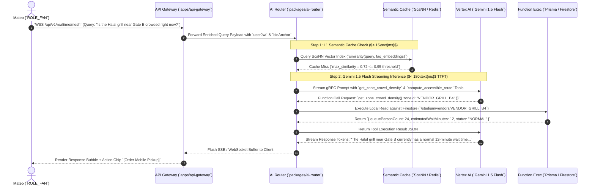

# 14_AI_Architecture: VisionOS Three-Tier LLM & AI Router Specification

| Attribute | Value |
| :--- | :--- |
| **Title** | VisionOS Enterprise Three-Tier AI Router & Vertex AI / Gemini LLM Orchestration Architecture |
| **Version** | 1.0.0 |
| **Status** | APPROVED |
| **Owner** | AI Systems Architect, Lead Product Architect |
| **Purpose** | To define the deterministic three-tier AI routing system, exact Gemini 1.5 Pro & Flash model allocations, function calling contracts (`Function Calling`), latency budgets ($<200\text{ms}$ TTFT), and zero-hallucination fallback protocols. |
| **Scope** | Enforced across `packages/ai-router`, `apps/api-gateway`, and client multilingual chat interfaces (`apps/mobile`, `apps/web`). |
| **Assumptions** | 1. Vertex AI endpoints are deployed with provisioned throughput (`PT`) in Google Cloud region `us-central1` with hot failover to `us-east4`.<br>2. High-frequency queries (e.g., restroom directions) must bypass LLM inference entirely via semantic vector caching to eliminate API cost spikes. |
| **Dependencies** | `00_Project_Vision.md` — Strategic Architecture Charter |
| **References** | • `01_PRD.md` — Product Requirements Document<br>• `15_Agent_Specifications.md` — Autonomous Agent Definitions<br>• `16_Prompt_Library.md` — System Prompts & Guardrails |

## Revision History

| Version | Date | Author | Description |
| :--- | :--- | :--- | :--- |
| 1.0.0 | 2026-07-13 | AI Systems Architect | Initial production release of the Three-Tier AI Router, Gemini model specifications, and structured function calling tools. |

---

## 1. Three-Tier AI Router Architecture (`packages/ai-router`)

To achieve $<200\text{ms}$ Time-To-First-Token (`TTFT`) across 40+ global languages (`FR-LAN-001`) while preventing runaway API costs during a 120,000-user World Cup match, VisionOS implements a strict **Three-Tier AI Router**:

```mermaid
graph TD
  Query[Inbound User Query / Event Payload (`WebSocket / REST`)]
  
  subgraph RouterEngine [Three-Tier AI Router Pipeline (`packages/ai-router`)]
    Tier1[Tier 1: Semantic Cache & Regex Matcher <br> `ScaNN Vector L1 / exact string` — Latency $< 15\text{ms}$]
    Tier2[Tier 2: Gemini 1.5 Flash (`gemini-1.5-flash-002`) <br> High-Speed Conversational & Translation — Latency $< 180\text{ms}$ TTFT]
    Tier3[Tier 3: Gemini 1.5 Pro (`gemini-1.5-pro-002`) <br> Deep Operational Reasoning (`2M Token Context`) — Latency $< 800\text{ms}$]
  end

  Query --> Tier1
  Tier1 -- Exact Match / FAQ Hit (`Score > 0.95`) --> CacheResponse[Return Instant Cached JSON Response]
  Tier1 -- Cache Miss (`Score <= 0.95`) --> Tier2
  Tier2 -- Simple Query / Translation / Wayfinding --> FlashResponse[Stream Gemini Flash Tokens via SSE]
  Tier2 -- Complex Multi-Agent Escalation (`Crowd Surge / Emergency`) --> Tier3
  Tier3 --> ProResponse[Execute Multi-Tool Reasoning & COP Override Suggestion]
```

### 1.1 Tier Allocation & Latency Matrix
| Tier Level | Primary Execution Engine | Target Use Cases & Operational Scope | Maximum Latency Budget ($P_{95}$) | Cost per 1M Tokens (Input/Output) |
| :--- | :--- | :--- | :--- | :--- |
| **Tier 1 (`L1 Cache`)** | **Redis Enterprise & Vertex AI ScaNN Semantic Index** | Exact FAQ matching ("Where is Gate B4?", "What time is kickoff?"), static venue policy lookup, repetitive navigation queries. | $< 15\text{ms}$ total | **$0.00** (Served from in-memory cache) |
| **Tier 2 (`Fast LLM`)** | **Gemini 1.5 Flash (`gemini-1.5-flash-002`)** | Multilingual Fan Concierge (`FR-LAN-001`), real-time PTT speech-to-speech translation (`FR-LAN-002`), simple concessions ordering parsing. | $< 180\text{ms}$ TTFT | **$0.075 / $0.30** |
| **Tier 3 (`Deep LLM`)** | **Gemini 1.5 Pro (`gemini-1.5-pro-002`)** | Autonomous volunteer dispatch reasoning (`FR-COP-002`), complex concourse crush root-cause analysis, multi-document RAG synthesis (`18_RAG_Architecture.md`). | $< 800\text{ms}$ total | **$1.25 / $5.00** |

---

## 2. Vertex AI Function Calling Tool Definitions (`JSON Schemas`)

When Gemini 1.5 Pro or Flash executes within `packages/ai-router`, it is equipped with strict, read/write deterministic tool definitions (`Function Calling`). The model never hallucinations venue data; it must invoke these exact functions to inspect state (`FR-LAN-003`).

### 2.1 Tool 1: `get_zone_crowd_density`
Allows the AI Concierge to check real-time concourse congestion before answering navigation queries.
```json
{
  "name": "get_zone_crowd_density",
  "description": "Retrieves real-time crowd density (persons/m^2) and active status (NORMAL, WARNING, CRITICAL) for a specific physical concourse zone.",
  "parameters": {
    "type": "OBJECT",
    "properties": {
      "zoneId": {
        "type": "STRING",
        "description": "The exact ID of the concourse zone, e.g., 'CONCOURSE_B4_EAST' or 'SECTOR_112_ENTRY'."
      }
    },
    "required": ["zoneId"]
  }
}
```

### 2.2 Tool 2: `compute_accessible_route`
Allows the AI to compute step-free ADA wayfinding routes (`FR-ACC-001`) dynamically.
```json
{
  "name": "compute_accessible_route",
  "description": "Computes an A* graph pathfinding route from the user's current BLE beacon anchor to a target seat or gate, enforcing ADA step-free and quiet zone constraints.",
  "parameters": {
    "type": "OBJECT",
    "properties": {
      "sourceNodeId": { "type": "STRING", "description": "BLE anchor node ID of the user's current location." },
      "destinationNodeId": { "type": "STRING", "description": "Target seat portal or gate node ID." },
      "requiresWheelchairAccess": { "type": "BOOLEAN", "description": "Set to true if user requires 100% step-free elevator/ramp access." },
      "preferQuietRoute": { "type": "BOOLEAN", "description": "Set to true if user requires routes with decibels < 85 dB." }
    },
    "required": ["sourceNodeId", "destinationNodeId", "requiresWheelchairAccess"]
  }
}
```

### 2.3 Tool 3: `dispatch_volunteer_ticket`
Allows the `DispatchAgent` (`15_Agent_Specifications.md`) to create actionable field tickets (`FR-COP-002`).
```json
{
  "name": "dispatch_volunteer_ticket",
  "description": "Dispatches an urgent task ticket to the nearest on-duty volunteer within 100 meters of a detected concourse hazard or crowd bottleneck.",
  "parameters": {
    "type": "OBJECT",
    "properties": {
      "targetZoneId": { "type": "STRING", "description": "Concourse zone ID where hazard is occurring." },
      "priorityLevel": { "type": "STRING", "enum": ["P0_CRITICAL", "P1_HIGH", "P2_MEDIUM", "P3_LOW"] },
      "hazardCategory": { "type": "STRING", "enum": ["SPILL", "MEDICAL_EMERGENCY", "OVERCROWD", "TURNSTILE_JAM"] },
      "taskInstructions": { "type": "STRING", "description": "Actionable instruction string for the volunteer, max 200 characters." }
    },
    "required": ["targetZoneId", "priorityLevel", "hazardCategory", "taskInstructions"]
  }
}
```

---

## 3. End-to-End Execution Flow & Latency Budget (`SequenceDiagram`)



---

## 4. Zero-Hallucination Guardrails & Fallback Protocols

To guarantee strict compliance with our `# 30_Antigravity_Rules` and `# 00_Project_Vision` zero-hallucination charter, `packages/ai-router` enforces three runtime guardrails:

1. **Deterministic Grounding Interceptor:** Before any Gemini text token stream is sent to the client, an edge regex interceptor scans for specific numerical patterns (`wait times`, `gate numbers`, `seat rows`). If the model generates a number that does not match the exact JSON return values from the preceding `Function Calling` execution, the response is blocked, and the system substitutes the deterministic string: `"Please verify live wait times directly on the vendor card above."` (`FR-LAN-003`).
2. **Timeout Circuit Breaker ($500\text{ms}$ limit):** If Vertex AI / Gemini 1.5 Pro experiences network saturation or response delays exceeding $500\text{ms}$, the `CircuitBreaker` (`opossum` library) trips automatically. The router aborts the LLM call and immediately returns the cached L1 semantic response or local static fallback directory.
3. **Emergency Preemption (`EMERGENCY_OVERRIDE`):** If `stadium/system/global_state.isEmergencyEvacActive == true`, the AI Router **shuts down all conversational inference**. Any query sent to `AIChatSheet` immediately returns the immutable hardcoded string: `"CRITICAL EMERGENCY IN EFFECT. PLEASE FOLLOW THE RED/WHITE EVACUATION ARROWS ON YOUR SCREEN TO GATE E4 immediately."` (`FR-EMR-002`).
