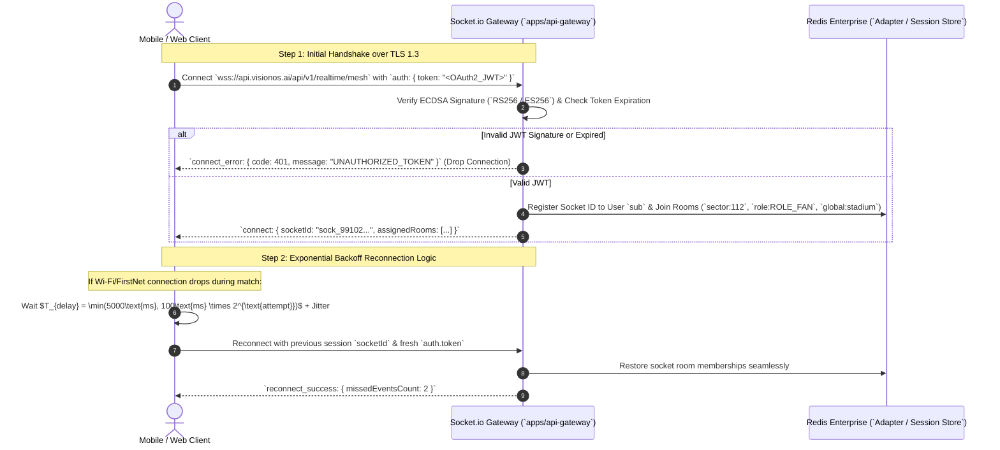

# 20_WebSocket_Flow: VisionOS Real-Time Push Gateway & Mesh

| Attribute | Value |
| :--- | :--- |
| **Title** | VisionOS Real-Time Push Gateway, WebSocket Handshakes, Reconnection Backoff, & Emergency Broadcast Mesh |
| **Version** | 1.0.0 |
| **Status** | APPROVED |
| **Owner** | Lead API Architect, Cloud Systems Architect |
| **Purpose** | To define the exact Socket.io v4 server/client authentication handshakes, room isolation topologies (`sector:XXX`), reconnection exponential backoff parameters, and high-priority `EMERGENCY_OVERRIDE` broadcast pipelines. |
| **Scope** | Enforced across `apps/api-gateway/src/websocket/`, `apps/mobile` (`Fan & Volunteer App`), and `apps/web` (`Organizer COP`). |
| **Assumptions** | 1. The Socket.io cluster is horizontally scaled across Google Cloud Run using Redis Enterprise (`@socket.io/redis-adapter`) for cross-node room broadcasts.<br>2. When `EMERGENCY_OVERRIDE` is emitted by the Commander, the message bypasses room filters and broadcasts to **all active sockets within < 50ms**. |
| **Dependencies** | `00_Project_Vision.md` — Strategic Architecture Charter |
| **References** | • `01_PRD.md` — Product Requirements Document<br>• `07_App_Flow.md` — FSM Emergency Preemption<br>• `13_API_Specification.md` — WSS Interface Contracts |

## Revision History

| Version | Date | Author | Description |
| :--- | :--- | :--- | :--- |
| 1.0.0 | 2026-07-13 | Lead API Architect | Initial release of Socket.io v4 gateway, JWT middleware, room topologies, and reconnection backoff. |

---

## 1. Socket.io v4 Gateway & Room Topology (`ERD / Room Map`)

```mermaid
graph TD
  subgraph ClientConnections [Active Connected Clients (`120,000 Concurrent Sockets`)]
    MobileFans[`apps/mobile` (`ROLE_FAN`)]
    MobileVolunteers[`apps/mobile` (`ROLE_VOLUNTEER`)]
    WebCOP[`apps/web` (`ROLE_ORGANIZER`)]
  end

  subgraph GatewayCluster [`apps/api-gateway/src/websocket/server.ts` (`Cloud Run`)]
    AuthMiddleware[`Socket.io JWT Auth Middleware` <br> Verify OAuth2 Signature & Extract Claims]
    RoomEngine[`Redis Adapter Room Router` (`@socket.io/redis-adapter`)]
  end

  subgraph RoomTopologies [Isolated Broadcast Rooms (`Redis Adapter`)]
    SectorRooms[`sector:{sectorId}` <br> e.g., `sector:SECTOR_112` (`Localized Concourse Updates`)]
    RoleRooms[`role:{roleName}` <br> e.g., `role:ROLE_VOLUNTEER` (`Staff Dispatches`)]
    GlobalRoom[`global:stadium` <br> (`Emergency Overrides & Event Timers`)]
  end

  MobileFans --> AuthMiddleware
  MobileVolunteers --> AuthMiddleware
  WebCOP --> AuthMiddleware

  AuthMiddleware --> RoomEngine
  RoomEngine --> SectorRooms
  RoomEngine --> RoleRooms
  RoomEngine --> GlobalRoom
```

---

## 2. Authentication & Reconnection Handshake Sequence (`SequenceDiagram`)



---

## 3. Reconnection & Backoff Parameters

To prevent 120,000 devices from triggering a thundering-herd DDoS against `apps/api-gateway` after a momentary cellular tower handoff, client SDKs enforce exact backoff jitter:

```ts
// apps/mobile/services/websocket.ts
import { io, Socket } from 'socket.io-client';

export function createVisionSocket(jwtToken: string): Socket {
  return io('https://api.visionos.ai', {
    path: '/api/v1/realtime/mesh',
    auth: { token: jwtToken },
    transports: ['websocket'],
    reconnection: true,
    reconnectionAttempts: 15,
    reconnectionDelay: 100,       // Minimum delay: 100ms
    reconnectionDelayMax: 5000,   // Maximum delay cap: 5000ms
    randomizationFactor: 0.5,     // Adds up to 50% random jitter to prevent synchronized reconnect bursts
    timeout: 10000,
  });
}
```

---

## 4. Production Socket.io Gateway Implementation (`apps/api-gateway/src/websocket/server.ts`)

```ts
import { Server, Socket } from 'socket.io';
import { createAdapter } from '@socket.io/redis-adapter';
import Redis from 'ioredis';
import jwt from 'jsonwebtoken';

const pubClient = new Redis(process.env.REDIS_ENTERPRISE_URL || 'redis://localhost:6379');
const subClient = pubClient.duplicate();

export interface VisionJwtClaims {
  readonly sub: string;
  readonly role: 'ROLE_FAN' | 'ROLE_VOLUNTEER' | 'ROLE_ORGANIZER' | 'ROLE_RESPONDER';
  readonly sectorCode: string;
}

export function initializeWebSocketGateway(httpServer: any): Server {
  const io = new Server(httpServer, {
    path: '/api/v1/realtime/mesh',
    cors: { origin: '*', methods: ['GET', 'POST'] },
    transports: ['websocket'],
  });

  io.adapter(createAdapter(pubClient, subClient));

  // Authentication Middleware
  io.use((socket: Socket, next) => {
    const token = socket.handshake.auth?.token as string | undefined;
    if (!token) {
      return next(new Error('AUTHENTICATION_REQUIRED: Bearer JWT missing in handshake'));
    }

    try {
      const decoded = jwt.verify(token, process.env.JWT_PUBLIC_KEY || 'secret') as VisionJwtClaims;
      socket.data.claims = decoded;
      return next();
    } catch (err) {
      return next(new Error('INVALID_TOKEN: JWT verification failed'));
    }
  });

  io.on('connection', (socket: Socket) => {
    const claims = socket.data.claims as VisionJwtClaims;
    console.log(`Socket connected: ${socket.id} (User: ${claims.sub}, Role: ${claims.role})`);

    // Automatically assign client to localized and role-based rooms
    void socket.join(`sector:${claims.sectorCode}`);
    void socket.join(`role:${claims.role}`);
    void socket.join('global:stadium');

    socket.on('disconnect', (reason) => {
      console.log(`Socket disconnected: ${socket.id} (Reason: ${reason})`);
    });
  });

  return io;
}

/**
 * Executes high-priority emergency broadcast across all connected devices in < 50ms (`FR-EMR-001`).
 */
export async function broadcastEmergencyOverride(io: Server, payload: {
  overrideId: string;
  emergencyType: string;
  targetSectorId: string;
  evacuationTargetSafeGate: string;
  instructions: string;
}): Promise<void> {
  // Broadcasts to 'global:stadium' room, instantly bypassing FSM locks across all mobile/web apps
  io.to('global:stadium').emit('EMERGENCY_OVERRIDE', payload);
}
```
