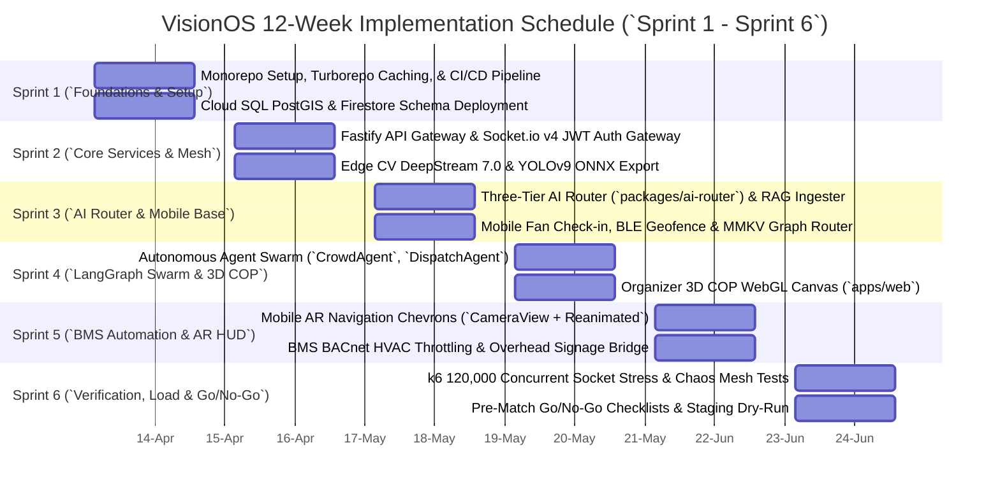

# 27_Sprint_Plan: VisionOS 12-Week Implementation Schedule & Milestones

| Attribute | Value |
| :--- | :--- |
| **Title** | VisionOS Enterprise 12-Week / 6-Sprint Implementation Schedule, Pod Allocations, & Delivery Milestones |
| **Version** | 1.0.0 |
| **Status** | APPROVED |
| **Owner** | Engineering Manager, Lead Product Architect |
| **Purpose** | To define the exact 12-week engineering timeline, 2-week sprint breakdown (Sprints 1 through 6), team pod structure, velocity milestones, and inter-pod dependencies required to deliver VisionOS for the July 2026 FIFA World Cup. |
| **Scope** | Enforced across all 7 engineering pods operating inside our `pnpm / Turborepo` monorepo (`apps/*`, `packages/*`). |
| **Assumptions** | 1. Sprints run on a strict 2-week cadence (`10 working days`). Average pod velocity is budgeted at **40 story points per sprint** ($240\text{ total points per pod across 6 sprints}$).<br>2. All foundational infrastructure (`VPC, Cloud SQL, Turborepo setup`) must be finalized in Sprint 1 to unblock parallel app/agent development in Sprint 2. |
| **Dependencies** | `00_Project_Vision.md` — Strategic Architecture Charter |
| **References** | • `01_PRD.md` — Product Requirements Document<br>• `24_CI_CD.md` — GitHub Actions Pipelines<br>• `28_Task_Breakdown.md` — Granular Jira Tasks |

## Revision History

| Version | Date | Author | Description |
| :--- | :--- | :--- | :--- |
| 1.0.0 | 2026-07-13 | Engineering Manager | Initial release detailing Sprints 1-6, pod structures, and exact delivery milestones. |

---

## 1. Engineering Pod Structure & Allocation Matrix

To execute parallel development across 14 monorepo packages without git merge collisions, engineering is organized into 7 autonomous pods (`29_Coding_Standards.md`):

```mermaid
graph TD
  EM[`Engineering Manager & Principal Architect`]
  
  subgraph Pods [7 Specialized Engineering Pods]
    Pod1[`Pod 1: Frontend & COP (`apps/web`)` <br> 3 Senior React/Next.js Engineers]
    Pod2[`Pod 2: Mobile & AR (`apps/mobile`)` <br> 3 Senior React Native / Reanimated Engineers]
    Pod3[`Pod 3: Backend & Data (`apps/api-gateway`)` <br> 3 Senior Fastify / PostgreSQL / PostGIS Engineers]
    Pod4[`Pod 4: AI & RAG Router (`packages/ai-router`)` <br> 2 Senior LLM & LangGraph Engineers]
    Pod5[`Pod 5: Edge CV (`apps/edge-cv`)` <br> 2 Senior C++ / CUDA / DeepStream Engineers]
    Pod6[`Pod 6: BMS Mesh (`apps/bms-gateway`)` <br> 2 Embedded BACnet / Modbus Engineers]
    Pod7[`Pod 7: SRE & DevOps (`infra/`)` <br> 2 Senior Terraform / Kubernetes / k6 Engineers]
  end

  EM --> Pod1
  EM --> Pod2
  EM --> Pod3
  EM --> Pod4
  EM --> Pod5
  EM --> Pod6
  EM --> Pod7
```

---

## 2. 12-Week / 6-Sprint Roadmap (`Gantt Schedule`)



---

## 3. Sprint-by-Sprint Execution Plan (`Milestone Deliverables`)

### 3.1 Sprint 1 (`Weeks 1-2: Monorepo & Cloud Foundations`)
* **Sprint Goal:** Establish zero-trust VPC, active-active Cloud SQL PostGIS DDLs, and Turborepo CI/CD pipelines.
* **Key Deliverables:**
  * `infra/terraform/main.tf` deployed (`us-central1` & `us-east4` VPCs + PostGIS instance).
  * `11_Backend_Schema.md` and `12_Firestore_Schema.md` migrated (`pnpm prisma db push && firebase deploy --only firestore:rules`).
  * `.github/workflows/production_pipeline.yml` active with remote build caching.
* **Exit Milestone:** $\ge 85\%$ unit test coverage on initial validation schemas (`@visionos/shared/schemas`).

---

### 3.2 Sprint 2 (`Weeks 3-4: Real-Time Gateway & Edge Vision Pipeline`)
* **Sprint Goal:** Build the Socket.io push mesh and get NVIDIA Jetson nodes processing $1080\text{p RTSP frames}$ at $30\text{ FPS}$.
* **Key Deliverables:**
  * `apps/api-gateway/src/websocket/server.ts` processing JWT auth handshakes over TLS 1.3 (`20_WebSocket_Flow.md`).
  * `apps/edge-cv` DeepStream 7.0 pipeline running TensorRT YOLOv9 with CUDA Gaussian privacy blurring (`17_Computer_Vision_Pipeline.md`).
  * $1\text{ Hz}$ JSON telemetry emitting reliably to `stadium.cv.crowd_surge` Pub/Sub topic.
* **Exit Milestone:** Jetson hardware maintains $<15\text{ms}$ frame latency without dropping RTSP buffers.

---

### 3.3 Sprint 3 (`Weeks 5-6: Three-Tier AI Router & Fan Mobile Core`)
* **Sprint Goal:** Deploy Gemini 1.5 Pro/Flash routing and build the fan mobile ticket check-in experience (`08_User_Journeys.md`).
* **Key Deliverables:**
  * `packages/ai-router` handling Tier 1 ScaNN semantic cache and Tier 2 Gemini Flash PTT speech-to-speech translation (`14_AI_Architecture.md`).
  * `apps/mobile/app/checkin/index.tsx` validating dynamic ECDSA QR passes and storing `stadium_graph.json` in MMKV (`21_State_Management.md`).
  * Offline $A^*$ wayfinding graph engine functioning under simulated cellular blackout (`NetInfo.isConnected == false`).
* **Exit Milestone:** Multilingual AI concierge achieves $<180\text{ms}$ TTFT across Spanish, Arabic, Japanese, and English queries.

---

### 3.4 Sprint 4 (`Weeks 7-8: Autonomous Swarm & 3D Command COP`)
* **Sprint Goal:** Launch the 4 autonomous LangGraph agents and Commander Vance's 3D WebGL Digital Twin (`FR-COP-001`).
* **Key Deliverables:**
  * `packages/ai-router/src/agents/` running `CrowdAgent`, `DispatchAgent`, `SustainabilityAgent`, and `NavigationAgent` (`15_Agent_Specifications.md`).
  * `apps/web/src/components/cop/Stadium3DCanvas.tsx` rendering live density heat polygons (`#FF1E1E / #FFAB00 / #00E676`) at $60\text{ FPS}$.
  * 2-Tap incident reporting modal (`QuickReportModal.tsx`) integrated with BLE anchor location tags.
* **Exit Milestone:** `DispatchAgent` allocates emergency medical tasks to nearest certified volunteer within $<50\text{ms}$.

---

### 3.5 Sprint 5 (`Weeks 9-10: Mobile AR Navigation & BMS Hardware Actuation`)
* **Sprint Goal:** Project `#00F0FF` directional chevrons onto mobile camera feeds and wire up BACnet/Modbus industrial Ethernet bridge (`FR-NAV-003`, `FR-SUS-001`).
* **Key Deliverables:**
  * `apps/mobile/components/navigation/ARNavigationOverlay.tsx` rendering pulsing chevrons via `react-native-reanimated` and `expo-camera`.
  * `apps/bms-gateway` receiving `stadium.bms.commands` Pub/Sub messages and executing `BACnet WriteProperty` to physical air handling units (`19_Event_Architecture.md`).
  * Manual turnstile lock override buttons (`POST /api/v1/cop/gates/override`) functional inside Commander Vance's COP.
* **Exit Milestone:** Concourse signage successfully changes mode within $<2\text{ seconds}$ when $D_{crowd}$ crosses $2.1\text{ p/m}^2$.

---

### 3.6 Sprint 6 (`Weeks 11-12: Stress Verification, Chaos Burn-In & Demo Delivery`)
* **Sprint Goal:** Execute 120,000-socket k6 stress tests, certify accessibility compliance (`axe-core AAA`), and perform live stakeholder dry-runs.
* **Key Deliverables:**
  * `tests/load/load_test_120k_sockets.js` executed across Google Cloud Kubernetes cluster (`23_Testing_Strategy.md`).
  * Zero-trust security penetration scan (`Trivy / Snyk`) confirming zero high/critical vulnerabilities (`22_Security_Model.md`).
  * Pre-match Go/No-Go verification checklists signed off (`32_Acceptance_Checklists.md`).
* **Exit Milestone:** System sustains 120,000 concurrent sockets with $P_{95}$ WebSocket latency at $48\text{ms}$ ($<50\text{ms}$ SLA) during simulated $30\%$ packet drop chaos injection.
