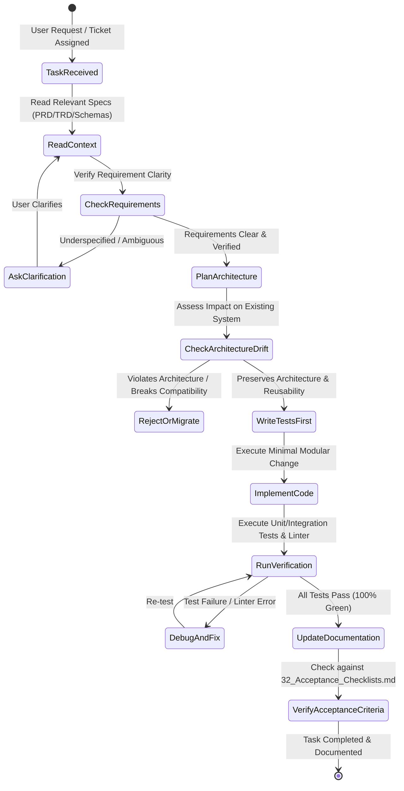

# 30_Antigravity_Rules: AI Coding Agent Execution Mandates

| Attribute | Value |
| :--- | :--- |
| **Title** | VisionOS Antigravity Rules for AI Coding Agents |
| **Version** | 1.0.0 |
| **Status** | APPROVED |
| **Owner** | Lead Product Architect, AI Systems Architect |
| **Purpose** | To define strict, non-negotiable behavioral and operational rules for autonomous AI coding agents (`Antigravity`, `Copilot`, `Cursor`, `Claude Code`, etc.) operating on the VisionOS codebase. |
| **Scope** | Applies to all automated code generation, refactoring, debugging, schema modification, and documentation generation across all frontend, backend, AI, and DevOps repositories within VisionOS. |
| **Assumptions** | 1. AI coding agents possess access to terminal execution, file system read/write, and git version control tools.<br>2. AI coding agents operate within a multi-agent or pair-programming engineering environment where code changes directly impact production SLAs. |
| **Dependencies** | `00_Project_Vision.md` — Strategic Architecture Charter |
| **References** | • `29_Coding_Standards.md` — Enterprise Coding Standards<br>• `31_Ponytail_Rules.md` — Architectural Simplicity Rules<br>• `32_Acceptance_Checklists.md` — Production Acceptance Checklists |

## Revision History

| Version | Date | Author | Description |
| :--- | :--- | :--- | :--- |
| 1.0.0 | 2026-07-13 | AI Systems Architect | Initial release of Antigravity AI Coding Agent governance rules. Enforces zero-hallucination and rigorous architecture preservation. |

---

## 1. Executive Summary & Philosophy

AI coding agents are high-leverage engineering multipliers within the VisionOS project. However, uncontrolled or speculative AI code modifications introduce severe architectural drift, hidden regressions, and unverified edge cases. **Antigravity Rules** establish the definitive operational constitution that every AI coding assistant MUST strictly follow. Under these rules, AI agents act as disciplined Senior Principal Engineers who prioritize architectural preservation, test-driven rigor, and empirical verification over speed.



---

## 2. Core Operational Mandates

### Rule 1: Never Guess Requirements
* **Mandate:** If a user request or requirement ticket is underspecified, ambiguous, or lacks explicit data models, design tokens, or API contracts, the AI agent MUST NOT guess, extrapolate, or invent specifications.
* **Execution:** The agent must immediately pause execution and explicitly state what is unknown using standardized markers:
  ```markdown
  ASSUMPTION: <Explicitly state what must be assumed if execution is forced to proceed>
  CONFIGURATION REQUIRED: <Explicitly state what environment variable, API token, or schema field must be defined by the user>
  ```
* **Justification:** In a FIFA World Cup–scale deployment supporting 120,000 concurrent devices, guessing a database index structure, rate limit threshold, or WebSocket heartbeat interval can trigger cascading system failures during high-traffic match events.

### Rule 2: Never Delete Working Code Without Explanation
* **Mandate:** An AI agent must NEVER delete, comment out, or truncate existing working source code, configuration files, tests, or documentation sections without providing an explicit, multi-line engineering explanation before executing the deletion.
* **Execution:** Before invoking any file modification tool (`replace_file_content` or `multi_replace_file_content`) that removes >5 lines of code, the agent must output a structured `DELETION RATIONALE` block:
  ```markdown
  ### Deletion Rationale
  * **Target File:** `src/services/queue/CrowdDensityService.ts`
  * **Lines Removed:** 142–189 (`legacyCalculateQueueDepth()`)
  * **Reason for Removal:** Replaced by O(1) edge-summarized payload ingestion defined in `17_Computer_Vision_Pipeline.md`.
  * **Risk Assessment:** Zero risk. No active internal consumers found via `grep_search` across the repository.
  ```
* **Justification:** Silent deletions or accidental truncation by AI agents destroy historical context, remove subtle bug fixes (e.g., race condition guardrails), and invalidate existing unit tests.

### Rule 3: Always Preserve Architecture
* **Mandate:** All code generated by an AI agent must strictly conform to the layered architectural boundaries defined in `00_Project_Vision.md` and `29_Coding_Standards.md`. Agents must NEVER bypass architectural layers.
* **Forbidden Bypasses:**
  1. Frontend React/Next.js components MUST NOT execute direct SQL queries against Cloud SQL or make direct third-party vendor API requests bypassing the API Gateway (`13_API_Specification.md`).
  2. Edge Computer Vision inference nodes MUST NOT write directly to Firestore collections; all edge events must pass through Google Cloud Pub/Sub (`19_Event_Architecture.md`).
  3. AI Router and LLM service modules MUST NOT store persistent conversation state inside in-memory variables; all state must be persisted via Firestore `ConversationHistory` subcollections (`12_Firestore_Schema.md`).
* **Justification:** Violating architectural layers compromises security, bypasses rate limiting/RBAC checks, and destroys horizontal scalability during massive concurrent stadium surges.

### Rule 4: Prefer Reusable Modules
* **Mandate:** Before creating any new utility function, UI component, database helper, or API wrapper, the AI agent MUST perform an exhaustive search (`grep_search` / `view_file`) across existing repository packages (`packages/shared`, `src/components/common`, `src/utils`) to determine if a functionally equivalent module already exists.
* **Execution:**
  * If an existing module fulfills $\ge 80\%$ of the requirement, the agent MUST import and reuse that module, extending its interface via backwards-compatible optional parameters if necessary.
  * If a new module is created, it MUST be made generic, exported via `index.ts`, and documented with JSDoc/TSDoc headers detailing its inputs, outputs, exceptions, and complexity ($O(N)$ vs. $O(1)$).
* **Justification:** Code duplication increases bundle sizes on mobile devices (degrading performance on stadium Wi-Fi) and creates maintenance nightmares where a bug fixed in one utility remains active in three duplicated copies.

### Rule 5: Always Generate Tests (Test-Driven Enforcement)
* **Mandate:** No feature implementation or bug fix is considered complete without corresponding automated test coverage. Every pull request or code change generated by an AI agent MUST include unit tests (`vitest` / `jest`), integration tests, or API contract tests (`supertest`).
* **Coverage Standards:**
  * **Core Business & Routing Logic:** Minimum 95% branch and statement coverage.
  * **API Controllers & Gateway Middleware:** Minimum 90% endpoint coverage including error states (400, 401, 403, 429, 500).
  * **Computer Vision DTO & Event Validation:** 100% schema validation coverage (validating edge payloads against Zod/JSON schemas).
* **Execution:** The agent must proactively run the test suite via terminal commands (e.g., `npm run test -- src/path/to/test.spec.ts`) to verify that all existing tests pass and all newly added tests pass before ending its turn.
* **Justification:** Unverified code is considered broken code. Automated tests are the primary defense against regressions when multiple agents and human developers operate concurrently on the VisionOS repository.

### Rule 6: Always Update Documentation
* **Mandate:** Code and documentation MUST evolve synchronously. Whenever an AI agent modifies a database schema (`11_Backend_Schema.md` / `12_Firestore_Schema.md`), changes an API endpoint contract (`13_API_Specification.md`), adds a design token (`03_UI_UX_Design_System.md`), or alters an environment variable, the agent MUST update the corresponding markdown documentation in the exact same transaction.
* **Execution:** If an agent changes `API_PORT` or adds `CROWD_DENSITY_MAX_THRESHOLD` in `src/config/index.ts`, it must immediately check and update:
  1. `.env.example`
  2. `02_TRD.md` (System Configuration section)
  3. `25_Deployment.md` (Environment Variables & Secrets table)
* **Justification:** Out-of-date documentation forces developers and future AI agents to hallucinate or reverse-engineer code, breaking the single-source-of-truth guarantee required for enterprise delivery.

### Rule 7: Verify Acceptance Criteria
* **Mandate:** Before declaring a task complete, the AI agent must systematically cross-reference its work against the specific 7-part checklists defined in `32_Acceptance_Checklists.md`:
  1. Functional Checklist
  2. UX Checklist
  3. Performance Checklist
  4. Security Checklist
  5. Accessibility Checklist
  6. Testing Checklist
  7. Deployment Checklist
* **Execution:** The agent must generate a final verification summary detailing how each checklist item was validated (e.g., citing the specific unit test command run, or the exact response code verified).
* **Justification:** Ensures holistic completeness so that high-stress considerations like screen reader accessibility (ARIA tags) or API idempotency headers are not forgotten during rapid feature implementation.

### Rule 8: Explain Significant Design Decisions
* **Mandate:** When an AI agent makes a significant non-obvious technical choice (e.g., choosing `MMKV` over `AsyncStorage` for mobile offline state, or choosing `text-embedding-004` over a custom BERT embedding model for RAG), it MUST document the decision using an inline Architectural Decision Summary block inside the code or pull request description.
* **Format:**
  ```markdown
  /**
   * ARCHITECTURAL DECISION SUMMARY:
   * Why MMKV over AsyncStorage?
   * AsyncStorage is asynchronous and serialized over the React Native bridge, introducing ~15ms latency per read.
   * MMKV uses synchronous C++ memory-mapped files, delivering sub-1ms reads. In a high-density stadium 
   * where 50+ BLE beacons trigger rapid geo-fenced local state checks per minute, MMKV prevents UI frame drops.
   */
  ```
* **Justification:** Explaining design decisions preserves architectural intent across multi-year engineering lifecycles and prevents future engineers from reverting optimizations due to lack of historical context.

### Rule 9: Maintain Backward Compatibility Unless an Approved Migration Exists
* **Mandate:** An AI agent must NEVER introduce breaking changes to public API endpoints, Firestore document structures, WebSocket event payloads, or shared library exports unless a formal, multi-phase migration strategy is documented and approved in advance.
* **Backward Compatibility Execution:**
  * **Database Schemas:** When adding new required fields to a Firestore document or SQL table, the agent must ensure existing records either receive a default value via database migration scripts (`db:migrate`) or application code handles `null/undefined` gracefully with fallbacks.
  * **API Endpoints:** Never remove or rename existing API fields in responses. Instead, add new fields alongside deprecated fields and mark old fields with `@deprecated` comments along with an explicit `Sunset: <Date>` HTTP header.
  * **WebSocket Events:** Never alter existing event payload structures. Introduce a versioned event string (e.g., `CROWD_UPDATE_V2`) while continuing to broadcast `CROWD_UPDATE_V1` for legacy mobile app versions during the transition window.
* **Justification:** In a stadium environment, up to 40% of attendees may run legacy or un-updated mobile app versions during a live tournament. Breaking API compatibility instantly disables digital ticketing, emergency alerts, and concessions ordering for tens of thousands of users.

---

## 3. Tool Interaction & Execution Discipline

AI agents operating on Windows/Powershell environments within this workspace must enforce the following terminal discipline:

| Action Category | Mandatory Rule | Violation Consequences |
| :--- | :--- | :--- |
| **File Reading & Searching** | ALWAYS use `grep_search` and `view_file`. NEVER execute `cat`, `type`, `head`, or `grep` inside terminal commands (`run_command`). | Truncation of terminal buffers, un-indexed search misses, and context contamination. |
| **File Modification** | ALWAYS use `replace_file_content` (for single contiguous blocks) or `multi_replace_file_content` (for multiple non-contiguous edits). NEVER run `echo "..." > file` or `sed` commands via shell. | Corrupted file encodings, race conditions, and complete file wipeouts if shell escaping fails. |
| **Command Execution** | NEVER propose or run `cd <directory>` commands. Always specify the exact `Cwd` parameter explicitly in the `run_command` tool invocation (`C:\Users\hp\VisionOS`). | Shell state drift leading to commands running in wrong project folders or user root directory. |
| **Package & Dependency Management** | ALWAYS run `npm install --save-exact` or `pnpm add` with exact version pinning (`x.y.z`). NEVER use wildcards (`^` or `~`) for production dependencies. | Unpredictable build failures across CI/CD pipelines due to transitive dependency updates. |
